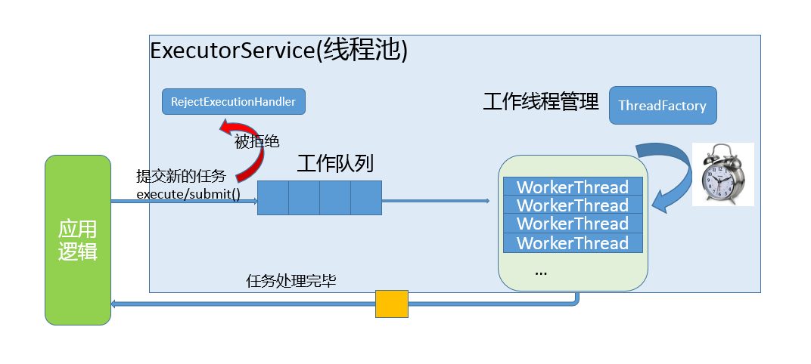

# 线程基础操作


# 线程同步


# 三、线程池（C）

## 3.1 通俗理解线程池

**场景模拟：餐厅点餐**

假设你开了一家餐厅，顾客点餐后需要厨师做饭。没有线程池时，你的做法可能是：

1. **每来一个顾客，就临时雇一个厨师**（创建新线程）。
2. 厨师做完菜后，**直接走人**（线程销毁）。

**问题**：

- 频繁雇人/解雇人（创建/销毁线程）**耗时耗钱**（线程创建开销大）。
- 如果突然来了100个顾客，你需要同时雇100个厨师，**厨房可能挤不下**（系统资源耗尽）。
- 厨师做完就走，**无法复用**，效率低。

**线程池的解决方案**

线程池就像餐厅的“固定厨师团队”：

1. **提前雇好一群厨师**（初始化线程池，创建固定数量线程）。
2. **顾客点餐时，从团队里分配一个空闲厨师**（线程池分配线程处理任务）。
3. **厨师做完菜后，回到团队等待下一个任务**（线程复用，不销毁）。
4. **如果顾客太多，厨师忙不过来，就让顾客排队等待**（线程池的队列机制）。

## 3.2 基本原理

线程池的组成主要分为3个部分，这三部分配合工作就可以得到一个完整的线程池：

1. **任务队列，存储需要处理的任务，由工作的线程来处理这些任务**

- 通过线程池提供的API函数，将一个待处理的任务添加到任务队列，或者从任务队列中删除
- 已处理的任务会被从任务队列中删除
- 线程池的使用者，也就是调用线程池函数往任务队列中添加任务的线程就是生产者线程

2. **工作的线程（任务队列任务的消费者） ，N个**

- 线程池中维护了一定数量的工作线程, 他们的作用是是不停的读任务队列, 从里边取出任务并处理
- 工作的线程相当于是任务队列的消费者角色，
- 如果任务队列为空, 工作的线程将会被阻塞 (使用条件变量/信号量阻塞)
- 如果阻塞之后有了新的任务, 由生产者将阻塞解除, 工作线程开始工作

3. **管理者线程（不处理任务队列中的任务），1个**

- 它的任务是周期性的对任务队列中的任务数量以及处于忙状态的工作线程个数进行检测
- 当任务过多的时候, 可以适当的创建一些新的工作线程
- 当任务过少的时候, 可以适当的销毁一些工作的线程



## 3.3数据结构设计

```c
//Task struct
typedef struct Task
{
    void (*function) (void * argc);
    void * argc;
}Task;

//Threadpool struct
struct ThreadPool
{
    Task * taskQ;
    int queueCapacity; //容量
    int queueSize;//任务队列大小
    int queueFront;//队列的头
    int queueRear;//队列的尾

    pthread_t managerID; //管理者id
    pthread_t *threadIDs;//工作线程id
    int minNum;//最小线程数量
    int maxNum;//最大线程数量
    int busyNum;//忙线程数量
    int liveNum;//活着线程数量
    int exitNum;//应该杀掉线程数量
    
    pthread_mutex_t mutexPool;//线程池互斥量
    pthread_mutex_t mutexBusy;//busyNum互斥

    pthread_cond_t notFull;
    pthread_cond_t notEmpty;
    int shutdown; //是否销汇线程池  销毁1  不销毁0
    
    
};

```

**头文件声明**

```cpp
#ifndef _THREADPOOL_H
#define _THREADPOOL_H

typedef struct ThreadPool ThreadPool;
// 创建线程池并初始化
ThreadPool *threadPoolCreate(int min, int max, int queueSize);

// 销毁线程池
int threadPoolDestroy(ThreadPool* pool);

// 给线程池添加任务
void threadPoolAdd(ThreadPool* pool, void(*func)(void*), void* arg);

// 获取线程池中工作的线程的个数
int threadPoolBusyNum(ThreadPool* pool);

// 获取线程池中活着的线程的个数
int threadPoolAliveNum(ThreadPool* pool);

//////////////////////
// 工作的线程(消费者线程)任务函数
void* worker(void* arg);
// 管理者线程任务函数
void* manager(void* arg);
// 单个线程退出
void threadExit(ThreadPool* pool);
#endif  // _THREADPOOL_H


```


# 线程池（C++）

```cpp
// 定义任务结构体
using callback = void(*)(void*);
struct Task
{
    Task()
    {
        function = nullptr;
        arg = nullptr;
    }
    Task(callback f, void* arg)
    {
        function = f;
        this->arg = arg;
    }
    callback function;
    void* arg;
};

// 任务队列
class TaskQueue
{
public:
    TaskQueue();
    ~TaskQueue();

    // 添加任务
    void addTask(Task& task);
    void addTask(callback func, void* arg);

    // 取出一个任务
    Task takeTask();

    // 获取当前队列中任务个数
    inline int taskNumber()
    {
        return m_queue.size();
    }

private:
    pthread_mutex_t m_mutex;    // 互斥锁
    std::queue<Task> m_queue;   // 任务队列
};

```

```cpp
class ThreadPool
{
public:
    ThreadPool(int min, int max);
    ~ThreadPool();

    // 添加任务
    void addTask(Task task);
    // 获取忙线程的个数
    int getBusyNumber();
    // 获取活着的线程个数
    int getAliveNumber();

private:
    // 工作的线程的任务函数
    static void* worker(void* arg);
    // 管理者线程的任务函数
    static void* manager(void* arg);
    void threadExit();

private:
    pthread_mutex_t m_lock;
    pthread_cond_t m_notEmpty;
    pthread_t* m_threadIDs;
    pthread_t m_managerID;
    TaskQueue* m_taskQ;
    int m_minNum;
    int m_maxNum;
    int m_busyNum;
    int m_aliveNum;
    int m_exitNum;
    bool m_shutdown = false;
};


```

