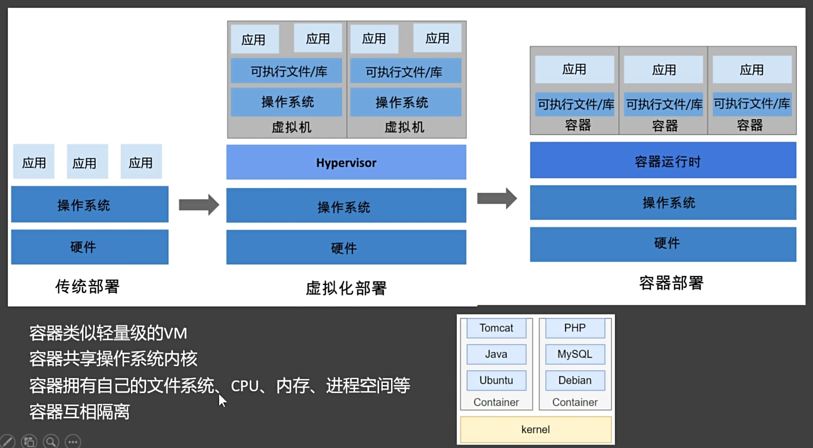

# Docker 的基本使用
## 镜像
~~~bash
docker search #查看
#镜像问题 备用查询 docker search docker-0.unsee.tech/ 
docker pull  #拉取镜像
docker image #查看所有镜像
docker rmi  #删除镜像
~~~
## 容器
在容器中运行的镜像可以分为两大类——**操作系统镜像**和**应用镜像**。它们在功能和用途上有明显的区别。

~~~sh
docker run      # 运行（默认 控制台阻塞行为——控制台启动）
docker ps       # 查看所有运行中的容器
docker ps -a    # 查看所有的容器
docker stop     # 停止
docker start    # 启动
docker restart  # 重启
docker stats    # 状态
docker logs     # 日志
docker exec     # 进入
docker rm       # 删除
docker commit   # 提交
docker save     # 保存
docker load     # 加载
~~~
## 镜像和容器的关系

## docker run 细节
### docker run   [参数]    镜像名 
- 参数放中间

参数详解：
1. `-d`  
   后台启动(daemon、守护进程) 
2. --name
   给容器起名字（不起名字会给个随机名字）
3. -p 
   端口映射
   -p 88:80（该参数表示，访问主机外部端口88 就等于访问该容器的80端口）
   问题：88（主机外部端口）能不能重复，80 （容器内部端口）能不能重复设置？---- 80可以重复，因为80是容器的端口，容器之间是隔离的。而88是主机的端口，主机的端口只能映射一次。

## docker exec 细节

~~~bash
docker exec -it <容器名称或ID> /bin/bash
~~~

参数详解：
1. -it
   以交互模式进入

## 删库小技巧
~~~bash
docker rm $(docker ps -aq)
~~~
docker ps -aq  的结果为所有容器ID
