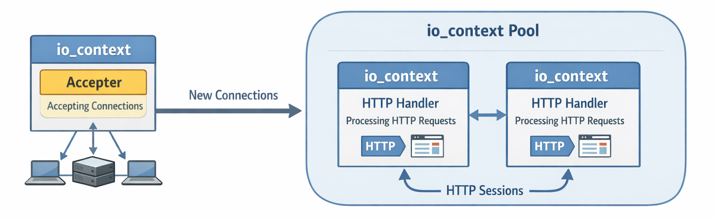
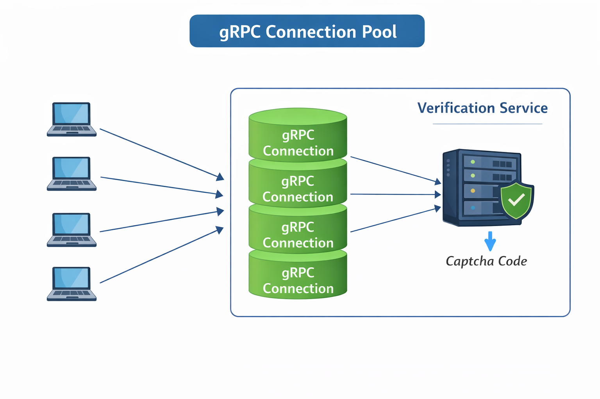
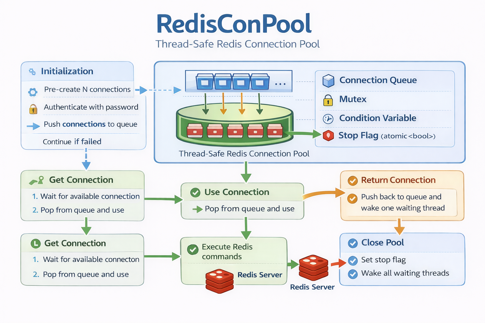

# InstantMessaging 项目技术总结（含八股复盘)

## 1. 开发环境

- 平台：Windows
- IDE：Visual Studio 2019
- C++ 标准：C++14（兼容旧版 gRPC）
- 构建系统：MSBuild（未来考虑 CMake）

## 2. 依赖库

- gRPC v1.40.0
- Protobuf v3.17.3
- Boost.Asio（网络 IO）


## 3.功能模块

连接池作用：高效管理连接资源，避免频繁创建/销毁，**保证连接使用过程线程安全**

io_context池



grpc连接池



redis连接池



mysql连接池

1.不用频繁创建连接关闭连接，减小开销

2.复用

3.多线程保证安全性


## 4.Linux移植


## 四、疑问记录

1.epoll/IOCP ？ boost::asio::io_context? muduo的eventloop？ reactor？

2.TCP socket和http请求的关系

3.该项目实现的服务器用的asio库 自带线程池 连接池？

4.为啥客户端-服务端为啥用http通讯 为啥服务端用grpc通讯 客户端服务端能不能用gprc通讯

5.ioc 到底是啥 为啥socket创建时候需要socket(ioc)

6.单例类为啥是shared_ptr   为啥不用unique_ptr

7.`std::unique_ptr` 没有拷贝构造函数（copy constructor），但为什么还能 `queue.push(unique_ptr)` 成功？

8.std::lock_guard<std::mutex>和std::unique_lock<std::mutex>  有什么区别

9.move后还需要pop吗？

10.`RPCConnPool`生产者-消费者模型

11.`condition_variable::wait` 的工作机制

12.讲以下MySQL的心跳机制

13.分离线程

## 五、疑问解答

4.

**客户端不是不能 RPC，而是通常不划算**

| 原因                   | 说明                                                         |
| ---------------------- | ------------------------------------------------------------ |
| **1. 浏览器限制**      | 浏览器 JS 只能发 HTTP(S) 请求（或 WebSocket），**不能直接建立 gRPC/TCP 连接**（除非用 gRPC-Web + 代理） |
| **2. 移动端兼容性**    | 虽然 App 可以集成 gRPC（如 Android/iOS 有官方库），但增加了复杂度，且对简单业务没必要 |
| **3. 开发 & 调试成本** | REST + JSON 人类可读；gRPC 的 Protobuf 二进制数据需要工具解析 |
| **4. 防火墙/NAT**      | 企业网络通常只放行 80/443，自定义 TCP 端口可能被阻断         |
| **5. 生态工具链**      | API 网关、监控、限流、鉴权等中间件对 HTTP 支持更成熟         |

例外：

- 游戏客户端（用自定义 TCP/UDP 协议）
- 高频交易系统（追求极致性能）
- 内网桌面应用（可控环境）

5.

- `io_context` 就是一个 **“任务调度中心”**
- 所有异步操作（如 `async_accept`, `async_read`）都会注册到它里面
- 调用 `ioc.run()` 就是 **启动事件循环（event loop）**，开始处理这些任务

**只要 socket 是用 `io_context&` 构造的，它就自动“隶属”于该 io_context**

- socket 本身不干活，它只是“注册器”：
  - 当你调用 `async_read(socket, ...)`，
  - Asio 会把 “监听这个 socket 的可读事件” **注册到 `ioc` 的内部 epoll/kqueue/IOCP 队列中**
- 只有隶属于 `ioc` 的 socket，才能被正确注册！

7.

**因为 `push()` 在这种情况下调用的是 移动构造（move constructor），而不是拷贝构造！**

------

**`push()` 的重载机制**

`std::queue::push()` 通常有两个重载（通过底层容器如 `deque` 实现）：

```cpp
void push(const T& value);   // 拷贝（需要拷贝构造）
void push(T&& value);        // 移动（需要移动构造）
```

- 当你传入 **左值**（如命名变量 `ptr`）→ 调用 `const T&` 版本 → 需要拷贝 → **失败**
- 当你传入 **右值**（如 `std::make_unique<>()`）→ 调用 `T&&` 版本 → 触发移动 → **成功**

9.

`std::move()` 做了什么？

```
auto context = std::move(connections_.front());
```

- `connections_.front()` 返回队列头部元素的引用（比如 `unique_ptr<Stub>&`）
- `std::move()` 将其转换为右值引用（`unique_ptr<Stub>&&`）
- 调用unique_ptr的移动构造函数：
  - `context` 获得了原 `unique_ptr` 指向的 `Stub` 对象的所有权
  - 队列中的原始 `unique_ptr` 被置为 `nullptr`（但**对象本身还在队列里**！）

11.

```cpp
cond_.wait(lock, pred);
```

其中：

- `lock` 是一个已上锁的 `std::unique_lock<std::mutex>`
- `pred` 是一个可调用对象（如 lambda），返回 `bool`

执行步骤如下：

1. **立即调用 `pred()` 检查条件**
   - 如果 `pred()` 返回 **`true`**：
     → **直接返回**，**不释放锁**，**不阻塞**，继续执行后续代码。
   - 如果 `pred()` 返回 **`false`**：
     → 进入下一步（准备等待）。
2. **原子地执行以下两个操作**（作为一个不可分割的整体）：
   - 释放 `lock` 所持有的互斥锁（`mutex_` 解锁）；
   - 将当前线程挂起，加入条件变量 `cond_` 的等待队列。
3. **当线程被唤醒时**（通过 `notify_one()` / `notify_all()`，或**虚假唤醒**）：
   - **自动重新获取 `mutex_` 锁**（即重新锁定 `lock`）；
   - **再次调用 `pred()` 检查条件**。
4. **循环判断**：
   - 如果此时 `pred()` 返回 **`true`** → `wait` 函数返回，继续执行；
   - 如果 `pred()` 仍为 **`false`** → **重复第 2 步**（再次释放锁并等待）。

12.

MySQL 的“心跳机制”并不是 MySQL 服务器原生提供的一种独立功能，而是**在客户端（或连接池、中间件、应用层）为了检测和维持数据库连接有效性而实现的一种主动探测机制**。它的核心目的是：

> **防止使用已经失效（如被防火墙断开、服务端超时关闭）的“僵尸连接”，避免执行 SQL 时突然报错。**

------

一、为什么需要心跳机制？

1. **连接可能被意外中断**

- 网络不稳定
- 防火墙/代理超时断开空闲连接（如 TCP keepalive 未启用或时间太长）
- MySQL 服务端主动关闭空闲连接（由 `wait_timeout` / `interactive_timeout` 控制，默认 8 小时）

2. **客户端不知道连接已失效**

- 应用程序持有连接句柄（如 C++ 的 `Connection*`、Java 的 `Connection` 对象）
- 下次执行 SQL 时才报错：`Lost connection to MySQL server` 或 `Communications link failure`
- 导致业务失败，用户体验差

✅ **心跳机制就是定期“探活”连接，提前发现并替换失效连接。**

------

二、MySQL 客户端如何实现心跳？

常见的心跳 SQL（轻量、只读、快速）：

```sql
SELECT 1;
-- 或
SELECT @@version;
-- 或
SHOW VARIABLES LIKE 'version';
```

这些语句：

- 几乎无性能开销
- 能真实测试连接是否可通信
- 不修改数据，安全

> ⚠️ 注意：不要用 `PING` 协议包（虽然 MySQL 协议支持），因为某些驱动/库不暴露该接口；用简单 SQL 更通用。

------

四、MySQL 服务端相关参数（影响连接存活）

虽然服务端不主动“发心跳”，但它会**清理空闲连接**：

| 参数                  | 默认值            | 作用                                        |
| --------------------- | ----------------- | ------------------------------------------- |
| `wait_timeout`        | 28800 秒（8小时） | 非交互式连接的最大空闲时间                  |
| `interactive_timeout` | 28800 秒          | 交互式连接（如 mysql 命令行）的最大空闲时间 |

> 🔸 如果你的连接池空闲连接超过这个时间，MySQL 会主动关闭它。
>  🔸 所以连接池的 **最大空闲时间** 应 **小于** `wait_timeout`（比如设为 7 小时），或者启用心跳检测。
