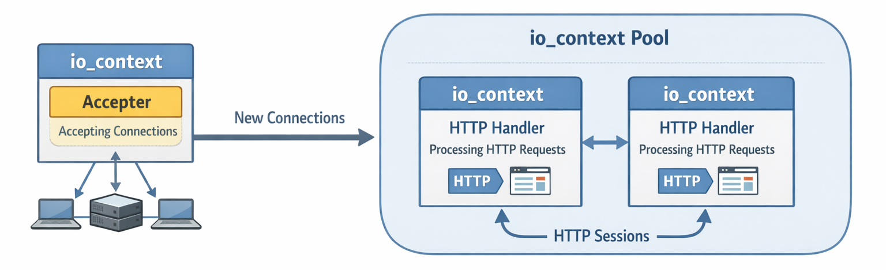
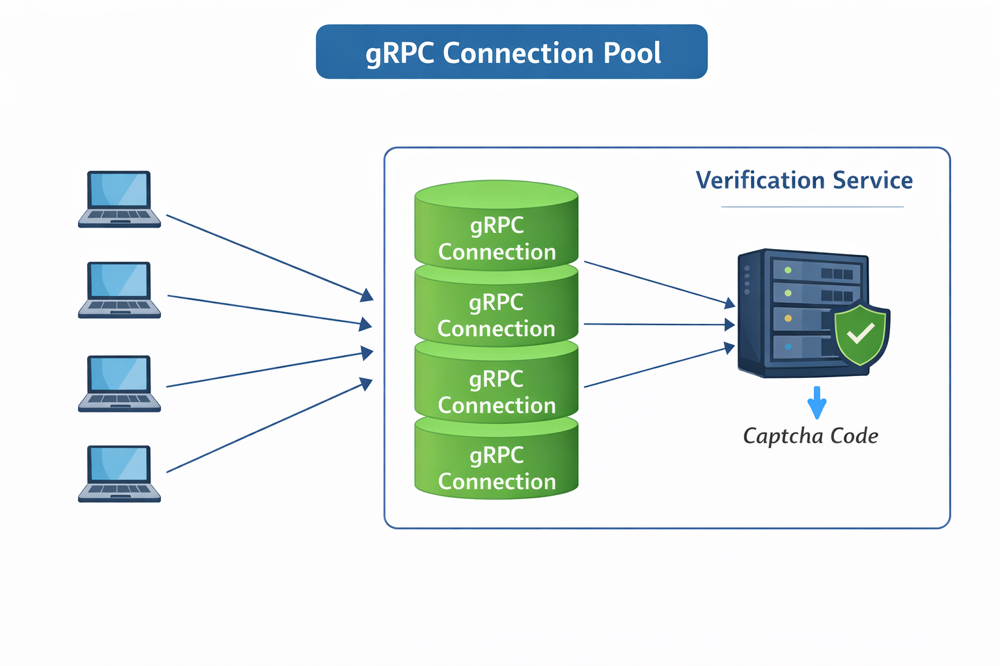
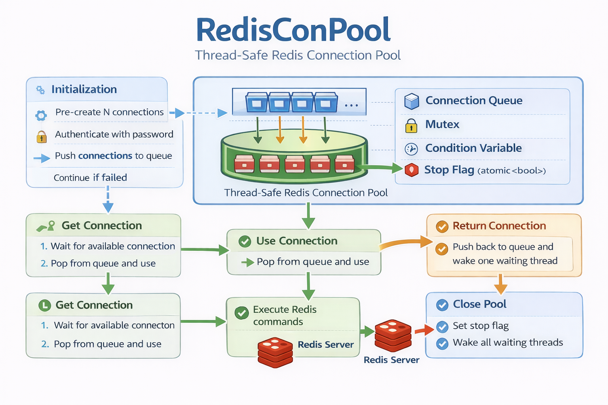

# InstantMessaging 项目技术总结（含八股复盘)

# 一、项目概述

- 项目背景与目的
- 项目要解决的核心问题
- 项目整体定位（一句话概括）

> 例：本项目实现了一个基于 XXX 的即时通讯系统，支持 XXX、XXX，用于 XXX 场景。

------

# 二、需求分析

## 2.1 功能需求

- 核心功能列表（如登录、聊天、好友、群组等）
- 非功能需求（性能、稳定性、安全性）

## 2.2 使用场景

- 典型使用流程
- 用户角色说明

------

# 三、系统设计

## 3.1 总体架构

- 系统整体架构说明（客户端 / 服务端 / 中间件）
- 架构设计思想（分层、解耦、模块化）

## 3.2 技术选型

- 编程语言
- 框架 / 中间件
- 数据库 / 通信协议
- 选型理由

### 1）GateServer → StatusServer：GetChatServer

目的：**给客户端选一个合适的 chatserver，并签发 token**

返回：`host/port/token`

### 2）Client → ChatServer：携带 uid/token 发起登录

（例如你 TCP 登录包里带 uid+token）

### 3）ChatServer → StatusServer：Login（其实是 VerifyToken）

目的：**验证 token 是否由 statusserver 颁发且未过期/未伪造**

------

# 四、模块设计与实现（⭐重点）

> **这是项目总结中最核心的一部分**

## 4.1 模块划分

- 模块划分图或文字说明
- 各模块职责概览

## 4.2 核心模块说明

按模块分别写（每个 1 小节）：

- 功能说明
- 关键设计点
- 关键实现思路

## 4.1 客户端TCP管理模块

### **4.1.1 功能说明**

客户端 TCP 管理模块（`TcpMgr`）负责维护客户端与聊天服务器之间的**长连接通信**，为即时通讯系统提供稳定、统一的网络通信能力。其主要功能包括：

- 管理客户端与聊天服务器的 TCP 长连接
- 统一处理 TCP 连接的建立、断开及异常情况
- 支持客户端与服务器之间的双向消息通信
- 负责 TCP 数据的封包、发送、接收与解析
- 向上层业务模块（如登录模块、聊天模块）提供统一的通信接口

通过该模块，业务逻辑无需直接操作底层 `QTcpSocket`，从而实现网络通信与业务逻辑的解耦。

------

### **4.1.2 关键设计点**

**（1）单例模式统一管理 TCP 连接**

由于客户端在同一时刻只需维护**唯一的聊天服务器连接**，TcpMgr 采用单例模式实现，确保全局仅存在一个 TCP 管理实例，避免多连接带来的状态混乱。

**（2）信号-槽机制保证线程安全**

考虑到客户端可能在不同线程中触发网络发送请求，TcpMgr 通过 Qt 的**信号-槽机制**转发发送请求，确保 TCP 数据的写操作始终在 TcpMgr 所在线程中执行，避免多线程并发访问 `QTcpSocket` 引发的问题。

**（3）长连接 + 自定义应用层协议**

为了支持即时通信的高频双向数据交互，模块采用 TCP 长连接方式（HTTP不支持双向交互），并在应用层设计了**消息头 + 消息体**的通信协议：

- 消息头：`消息ID + 消息长度`
- 消息体：具体业务数据（JSON 格式）

该设计有利于支持多种业务消息的扩展与解析。

**（4）粘包 / 半包处理机制**

TCP 属于流式协议，可能出现**粘包或半包问题**。模块内部通过缓冲区 `_buffer` 及状态变量 `_b_recv_pending`，实现对不完整数据的缓存和重组，确保每次只解析完整消息。

**（5）网络异常统一处理**

模块集中处理连接失败、服务器断开、网络异常等情况，并通过信号将结果反馈给上层 UI 或业务模块，提升系统的健壮性。

------

### 4.1.3 关键实现思路

**（1）TCP 连接管理**

TcpMgr 内部维护一个 `QTcpSocket` 对象，通过槽函数 `slot_tcp_connect` 接收服务器信息并建立连接。连接结果通过信号 `sig_con_success` 通知上层模块。

**（2）发送流程设计**

当业务模块需要发送 TCP 数据时，不直接调用 socket，而是：

1. 发送 `sig_send_data` 信号
2. TcpMgr 在对应槽函数中进行数据封包
3. 统一通过 `_socket.write()` 发送数据

这种设计避免了多线程环境下直接操作 socket 的风险。

**（3）数据封包与发送**

发送数据时，先将业务数据转换为 UTF-8 字节流，再通过 `QDataStream` 写入消息 ID 和消息长度，最终形成完整的发送数据块，保证服务器能够正确解析。

**（4）接收与解析流程**

当 socket 收到数据时：

1. 将数据追加至缓冲区 `_buffer`
2. 判断是否已接收到完整消息头
3. 根据消息长度判断消息体是否完整
4. 若完整则解析并处理，否则继续等待数据

该流程可正确处理 TCP 粘包和拆包问题。

**（5）与登录流程的解耦协作**

在 HTTP 登录成功后，登录模块仅负责：

- 获取聊天服务器信息
- 通过信号通知 TcpMgr 建立连接

后续聊天服务器登录及通信流程均由 TcpMgr 负责，实现模块职责清晰、分工明确。

> TcpMgr 模块作为客户端即时通讯系统中的核心基础模块，承担了长连接管理、消息收发及协议解析等关键职责。通过单例模式、信号-槽机制及自定义应用层协议的设计，该模块在保证线程安全与系统稳定性的同时，为上层业务模块提供了清晰、统一且可扩展的网络通信接口。

## 4.2 TCP服务器ChatServer模块

### 4.2.1 功能说明

ChatServer 是即时通讯系统中的 **TCP 长连接服务端核心模块**，负责接收客户端（Qt 客户端）发起的 TCP 连接请求，并在连接建立后完成消息的接收、解析、转发及响应。其主要功能包括：

- 监听指定端口，异步接收客户端 TCP 连接
- 维护客户端会话（Session）的生命周期
- 基于自定义应用层协议解析客户端发送的数据
- 将解析后的消息投递至逻辑层进行业务处理
- 将逻辑层处理结果通过 TCP 回写给客户端
- 支持多连接并发处理，保证服务器高并发与高可用性

------

### 4.2.2 关键设计点

**1. 基于 Asio 的异步网络模型**

ChatServer 采用 Boost.Asio 提供的异步 IO 模型，避免阻塞式网络操作带来的性能瓶颈，使服务器能够在高并发场景下高效运行。

**2. 主 IOContext + IOServicePool 的多线程架构**

- 主 `io_context` 负责监听新连接（accept）
- `AsioIOServicePool` 内部维护多个 `io_context`，并由线程池驱动
- 每个新连接（Session）被分配到不同的 `io_context` 中处理读写操作
   这种设计有效分散 IO 压力，提高服务器的并发处理能力。

**3. Session 层解耦连接与业务**

每个客户端连接由一个独立的 `CSession` 对象管理，Session 只关注：

- Socket 读写
- 协议解析
- 会话生命周期

而不直接处理具体业务逻辑，保证模块职责单一、结构清晰。

**4. 自定义应用层协议设计**

服务器与客户端采用 **消息头 + 消息体** 的通信协议：

- 消息头：消息 ID + 消息长度（网络字节序）
- 消息体：具体业务数据（JSON 字符串）
   该协议设计简单清晰，易于扩展不同类型的业务消息。

**5. 粘包 / 半包问题的显式处理**

通过“按长度递归读取”的方式，确保：

- 每次只在数据完整时才进行解析
- 正确处理 TCP 粘包、拆包问题
- 避免错误解析导致协议错位

**6. 网络 IO 与业务逻辑的解耦**

解析完成的消息不会直接在 IO 回调中处理，而是封装为逻辑节点投递至 `LogicSystem` 的消息队列中，由独立线程进行业务处理，避免阻塞 IO 线程。

------

### **4.2.3 关键实现思路**

**1. 服务器启动与监听流程**

- 主函数创建 `io_context` 并初始化 `CServer`
- `CServer` 构造函数中启动异步监听（`async_accept`）
- 信号监听（SIGINT / SIGTERM）用于优雅退出服务器

**2. 异步接收新连接**

- 使用 `async_accept` 接收客户端连接
- 为每个新连接创建一个 `CSession`
- Session 内部持有 socket 并负责后续通信
- Server 维护 Session 映射表，用于统一管理连接

**3. 分阶段异步读取数据**

Session 内部采用 **“先读头，再读体”** 的方式：

1. 异步读取固定长度的消息头
2. 从消息头中解析消息 ID 和消息体长度
3. 根据长度异步读取完整消息体
4. 读取完成后进入业务处理流程

该流程通过递归 `async_read_some` 实现，确保读取指定长度的数据。

**4. 协议解析与合法性校验**

在解析过程中对：

- 消息 ID
- 消息长度
   进行合法性检查，若异常则立即关闭连接并清理 Session，提升系统安全性和健壮性。

**5. 消息投递到逻辑层处理**

解析完成的消息被封装为逻辑节点，投递至 `LogicSystem` 的队列中，由独立线程异步处理，实现：

- 网络 IO 与业务逻辑解耦
- 避免 IO 线程被复杂逻辑阻塞

**6. 逻辑层回包机制**

逻辑层根据消息 ID 调用对应的处理回调函数（如登录处理），并通过 Session 接口将处理结果重新发送给客户端，完成一次完整的请求-响应流程。

------

> ChatServer 模块基于 Boost.Asio 构建了一个高并发、非阻塞的 TCP 长连接服务器架构，通过 Session 层、IO 线程池与逻辑处理线程的分离，实现了网络通信与业务逻辑的有效解耦。该设计不仅保证了系统的性能与稳定性，也为后续功能扩展（如 token 验证、跨服务通信）提供了良好的基础。

------

## 4.3 客户端 UI 交互模块

### 功能说明

- 提供两个可复用的 UI 组件：
  - **ClickedBtn**：支持 normal/hover/press 三态的按钮皮肤切换
  - **ClickedLabel**：支持可点击、可选中（Normal/Selected）两套状态，并在 hover/leave 时自动切换对应皮肤，同时对外发出 `clicked()` 信号
- 通过 QSS 控制具体视觉（图片、颜色等），代码只负责状态切换。

### 关键设计点

- **状态与样式解耦**：把“视觉表现”放在 QSS，把“何时进入某状态”放在 C++ 事件处理里。
- **动态属性驱动样式**：统一使用 `setProperty("state", xxx)` 作为状态通道，让 QSS 用 `[state='xxx']` 精确匹配。
- **轻量状态机**：
  - ClickedBtn：三态（normal/hover/press）由鼠标事件决定
  - ClickedLabel：两模式（Normal/Selected）+ 每种模式下的 hover/normal
- **不破坏原生行为**：事件处理最后调用基类 `QPushButton/QLabel` 的对应函数，保持 Qt 默认事件链路。

### 关键实现思路

1. 定义控件子类（继承 QPushButton/QLabel），重写 `enterEvent/leaveEvent/mousePressEvent/...`
2. 在事件发生时更新动态属性 `state`：
   - normal/hover/press 或 selected/selected_hover 等
3. 调用 `repolish(this)` 触发 Qt 重新应用样式，再 `update()` 立即重绘
4. 在 QSS 中针对 objectName 或类名 + `[state='...']` 写规则（常用于 `border-image` 或背景色等）
5. 对 ClickedLabel 额外维护 `_curstate`，点击切换并 `emit clicked()` 供外部业务逻辑响应。

## 4.4 聊天服务分布式与负载均衡模块

### 功能说明

- **ChatServer 分布式部署**：将单体 chatserver 扩展为多实例（例如 chatserver1、chatserver2）同时对外提供 TCP 聊天服务。
- **StatusServer 负载均衡**：StatusServer 根据每个 chatserver 当前的**在线连接数/登录数**，选择负载最小的 chatserver，返回给 GateServer（进而返回给客户端）。
- **服务端端通信能力（端对端）**：为 chatserver 增加 **gRPC 客户端 + gRPC 服务端**，使多个 chatserver 之间可以相互通知/同步（如好友申请、授权、文本消息等，当前先打通框架，业务逻辑可后续补齐）。
- **连接数统计与分配验证**：同时启动两个 chatserver、gateserver、statusserver，并让两个客户端登录，观察到客户端被分配到不同 chatserver，从而验证负载均衡有效。

------

### 关键设计点

1. **职责分层清晰**
   - GateServer：入口/路由，负责向 StatusServer 查询“该连哪个 chatserver”。
   - StatusServer：服务发现 + 负载均衡 + token 颁发/校验（你这里 token 用 Redis/内存均可，文中是 Redis 方案）。
   - ChatServer：承载业务 TCP 连接与聊天逻辑，同时提供 gRPC（用于多实例间的内部通知）。
2. **Redis 作为分布式状态中心**
   - 用 Redis Hash `LOGIN_COUNT` 维护每个 chatserver 的实时连接数：
     - chatserver 启动：初始化 `LOGIN_COUNT[server_name] = 0`
     - 用户登录：`LOGIN_COUNT[server_name]++`
     - chatserver 关闭：删除对应 field
   - 用 Redis KV `USERIPPREFIX + uid` 记录用户当前在哪个 chatserver（为未来“重复登录踢人 / 路由消息转发”做准备）。
3. **连接管理与踢人扩展**
   - 引入 `UserMgr`：维护 `uid -> session` 映射，支持后续“同账号二次登录踢旧连接”“断线清理”等能力。
   - `ClearSession()` 异常断开时移除 uid 与 session 的关联，避免脏引用。
4. **gRPC 连接池与单例客户端**
   - `ChatConPool`：为每个对端 chatserver 维护 Stub 连接池，避免频繁创建 channel/stub 带来的性能与资源开销。
   - `ChatGrpcClient` 单例：按配置 `PeerServer.Servers` 建立多个对端池 `_pools[name]`，为跨服通知提供统一出口。
5. **双端口服务模型（同一 chatserver 既 TCP 又 gRPC）**
   - chatserver 同时监听：
     - TCP Port：面向客户端连接
     - RPCPort：gRPC 内部通信
   - gRPC server 通过独立线程 `server->Wait()` 持续运行，退出时在信号处理里 `Shutdown()`，保证优雅关闭。

------

### 关键实现思路

1）配置驱动的多实例部署

- chatserver 配置：
  - `[SelfServer] Name/Host/Port/RPCPort`
  - `[PeerServer] Servers=chatserver2,...`
  - `[chatserver2] Host/Port`（对端 RPC 地址）
- statusserver 配置：
  - `[chatservers] Name=chatserver1,chatserver2`
  - 每个 `[chatserverX] Host/Port`（客户端要连的 TCP 地址）

> 通过逗号切割列表 → 再按名字查配置段 → 动态组装服务列表与连接池。

------

2）ChatServer 启动与连接数初始化

- 启动时：
  - `Redis HSet(LOGIN_COUNT, server_name, "0")`
  - 启动 gRPC 服务监听 `SelfServer.Host:RPCPort`
  - 启动 TCP 服务监听 `SelfServer.Port`
- 退出时：
  - `Redis HDel(LOGIN_COUNT, server_name)`
  - `server->Shutdown()` + join gRPC 线程

------

3）用户登录时：校验 + 绑定 + 计数更新

在 `LogicSystem::LoginHandler` 中完成：

- 从 Redis 取 token 校验（`USERTOKENPREFIX+uid`）：
  - 不存在 → `UidInvalid`
  - 不一致 → `TokenInvalid`
- 查询用户基础信息并回包（base_key = `USER_BASE_INFO + uid`）
- 更新负载计数：
  - `count = HGet(LOGIN_COUNT, server_name)` → `count++` → `HSet`
- 绑定与路由信息：
  - `session->SetUserId(uid)`
  - `Set(USERIPPREFIX+uid, server_name)` 记录用户所在 chatserver
  - `UserMgr::SetUserSession(uid, session)` 记录 uid-session 映射

------

4）StatusServer：基于 Redis 计数选择最小负载的 chatserver

- `GetChatServer()` 调用 `getChatServer()`：
  - 遍历 `_servers`（来自配置文件）
  - 对每个 server：
    - `HGet(LOGIN_COUNT, server.name)` 得到连接数
    - 不存在默认 `INT_MAX`（避免选到异常/未注册实例）
  - 选出 `con_count` 最小的 server 作为返回目标
- 将该 server 的 `host/port` 返回给 GateServer，并生成 token 返回给客户端（以及存储 token 供 chatserver 校验）。

------

5）验证：多实例分配效果

- 启动：chatserver1/chatserver2 + gateserver + statusserver
- 两个客户端分别登录
- 观察登录被分配到不同 chatserver → 证明“按连接数最小策略”的负载均衡生效


## 五、关键技术与难点

- 遇到的主要技术难点
- 问题原因分析
- 解决方案
- 取舍与优化思考

> 这一部分非常加分，体现**“你真的做过”**

------

## 六、运行环境与部署

### 6.1 开发环境

- 操作系统
- 编译器 / IDE
- 依赖库

### 6.2 运行环境

- 服务端部署方式
- 启动流程说明

------

## 七、测试与效果展示

### 7.1 功能测试

- 主要功能测试结果

### 7.2 性能或稳定性测试（如有）

- 并发情况
- 延迟 / 吞吐量（定性即可）

------

## 八、问题记录与解决（可选但很加分）

- 开发过程中遇到的问题
- 排查过程
- 最终解决方式

------

# 九、项目不足与改进方向

- 当前项目的不足
- 可扩展方向
- 后续优化计划

> 老师很喜欢这一部分，说明你有反思能力

------

## 9.1 聊天数据界面面对大数据时候性能不佳方案

在 UI 放一个占位 QWidget，提升为 `ChatView`，内部自己管理 `QScrollArea + 内容布局` ，你每条消息都 `setItemWidget` 塞一个 QWidget 气泡，本质还是“堆很多 QWidget”，大了会卡。

**如果消息量会很大/要分页加载/要性能**：最终更推荐 **QListView + 自定义 Model + Delegate**（你列的是 ListWidget，但真正的性能路线是 View+Model）。

### 9.1.1 现方案的性能瓶颈

现在是：`QScrollArea` 里塞一个 content QWidget，然后 `QVBoxLayout` 里不断 `insertWidget` 添加气泡 QWidget。

当消息量大（几千~几万）会出现：

1. **QWidget 太重**
    每条消息一个 QWidget（再加头像、文字、按钮…），对象数爆炸：

- 内存占用高
- 事件分发/样式/QSS 计算成本高
- 布局计算（sizeHint + relayout）越来越慢

1. **布局 O(n) 重排**
    `QVBoxLayout` 插入后会触发重新布局，消息多时一插就卡。
2. **绘制与更新不可控**
    很多子控件会触发 update/repaint，滚动时也容易抖。

一句话总结（面试可用）：

> “ScrollArea + 一堆 QWidget 的聊天气泡，属于‘小数据易用，大数据必卡’的典型实现。”

------

### 9.1.2 高性能正确路线：QListView + 自定义 Model + Delegate（虚拟化）

核心思想：**不要为每条消息创建一个 QWidget**。
 只保留“数据”，让 view 只绘制可见区域（virtualization）。

### 架构

- **Model（数据层）**：继承 `QAbstractListModel`
  - 保存 `Message` 列表（id、时间、发送者、文本、图片路径、状态等）
  - 支持 `rowsInserted/rowsRemoved/dataChanged`，局部刷新
- **View（显示层）**：`QListView`
  - 负责滚动、选择、可见区域管理
  - 只会向 model 请求可见项的数据
- **Delegate（渲染层）**：继承 `QStyledItemDelegate`
  - `paint()` 自己画气泡（背景圆角、头像、文本、时间、发送状态）
  - `sizeHint()` 计算每条消息高度（按文本换行/图片大小决定）

这套是 Qt 的“官方范式”，性能上限高很多。

------

3. 为什么它快？

3.1 视图虚拟化：只绘制可见项

QListView 滚动时只绘制屏幕能看到的那几十条，而不是几万条都在 QWidget 里活着。

3.2 内存模型：只存数据，不存控件树

- `Message` 是轻量结构体/对象
- 没有成千上万个 QWidget / layout / style 计算

3.3 局部更新：精确刷新

比如消息发送状态变化，只 `dataChanged(index)` 刷新那一条，而不是整个 layout 重排。

------

4. 关键实现点（你可以“讲细节”显得真做过）

4.1 Model 设计（QAbstractListModel）

- `rowCount()` 返回消息数量
- `data()` 用 role 区分字段：文本、时间、方向（自己/对方）、头像、图片等
- 新消息追加：
  - `beginInsertRows(QModelIndex(), n, n)`
  - push_back
  - `endInsertRows()`

> 面试话术：
>  “插入一条消息是 O(1)，view 只更新新增区域。”

4.2 Delegate 画气泡（paint/sizeHint）

- `paint()` 用 `QPainter` 画圆角矩形 + 文本（`QTextLayout` 或 `QFontMetrics::boundingRect`）
- `sizeHint()` 计算高度（按最大宽度换行）
- 左右对齐：根据 role（incoming/outgoing）决定气泡 x 位置

> 加分点：
>  “我会缓存 sizeHint 结果（按 message id / 文本 hash）避免反复计算。”

4.3 高度不等的列表：必须设置合适模式

- `QListView::setUniformItemSizes(false)`（聊天通常不等高）
- 开启/关闭一些昂贵特性：
  - `setSelectionMode(NoSelection)`（如果不需要选中）
  - `setHorizontalScrollBarPolicy(AlwaysOff)`
  - `setVerticalScrollMode(QAbstractItemView::ScrollPerPixel)`（更顺滑）

4.4 “自动滚到底部”与“插入历史消息不跳动”

- 新消息到来：如果用户当前在底部附近才自动滚，否则保持当前位置并显示“新消息”提示
- 加载历史消息（往上 prepend）：
  - 插入前记录 `QScrollBar::value()` 和当前顶部可见项 `indexAt(viewport()->rect().topLeft())`
  - 插入后用 `scrollTo()` 或调整 scrollbar value 保持视觉位置不变

> 面试话术：
>  “历史消息加载最怕跳屏，我会用 anchor item 保持滚动锚点。”

------

5. 大数据聊天必备：分页/懒加载（你可以当亮点讲）

5.1 “滚到顶部自动加载更多”

监听：

- `verticalScrollBar()->valueChanged`
- 或 view 的 `scrollToTop` 触发点

当 value 接近 0：

- 向后端请求上一页（比如 50 条）
- model `beginInsertRows(0, k-1)` 把数据插到头部
- 保持锚点不动（上一节的方法）

5.2 图片/头像异步加载 + 缓存

- `QPixmapCache` / 自己的 LRU cache
- 后台线程加载图片，加载完发信号 `dataChanged` 更新那条消息
- 避免在 `paint()` 里做 I/O

> 面试官很吃这点：
>  “paint 必须纯绘制，不能阻塞。”

------

6. 进一步的极致优化（可选加分）

- **批量插入**：一次插 50 条，减少信号开销
- **文本布局缓存**：对长文本缓存 `QTextLayout` 结果
- **避免频繁 update**：发送状态变化合并刷新（节流/合并 dataChanged）
- **视图回收策略**：如果用 `QML ListView` 或者自建复用池也能讲，但 Qt Widgets 下 delegate 已经足够

------

7. 面试“总结金句”（你可以直接背）

> “小项目我用 QScrollArea + QWidget 气泡实现很快，但它的性能瓶颈是控件数量和 layout 重排；真正要支撑上万条消息，我会改成 Qt 的 Model/View/Delegate：QListView + QAbstractListModel 存数据，delegate 负责绘制气泡，实现虚拟化渲染、局部刷新、分页加载和异步图片缓存，这样滚动和插入都是可控且高性能的。”

------

如果你想更“落地”，我还可以给你一份**面试用的伪代码骨架**（Message 结构、Model 的 roles、Delegate 的 paint/sizeHint、以及“顶部加载更多保持锚点”的核心代码），你背着就能讲得非常像真的做过。1. 现方案的性能瓶颈（面试官最爱听的点）

**UI + QSS**：适合“皮肤/布局”频繁改、统一风格、多人协作（设计改 QSS，你改逻辑）

**纯代码 setStyleSheet**：适合“样式跟业务状态强绑定”、运行时动态拼装（比如聊天气泡颜色、角色状态）

## 9.2  头像不显示Bug

## 我遇到的现象（Symptom）

我用 `QScrollArea + QVBoxLayout` 做聊天消息列表，每发一条消息就 `insertWidget` 进去。
 **当消息数量到大概 36 条左右时，新的消息气泡还在，但头像开始不显示**（有时前面的也会出现异常）。

关键点：

- 滚动条正常
- item 位置也正常
- 只是头像突然“没了”

------

## 2）我先做了哪些错误方向的排查（Hypothesis → Falsify）

一开始我怀疑是 UI 布局问题：

- **怀疑滚动条遮挡头像**：因为我之前自定义过 `QScrollBar` 的布局（把滚动条 add 到 layout 里）。
  - 我去掉自定义滚动条布局，改回 `ScrollBarAsNeeded`，问题仍然存在 ✅排除
- **怀疑布局列宽/拉伸比例导致头像列被挤掉**：
  - 我给 `QGridLayout` 设置 `setColumnMinimumWidth` / `setColumnStretch`，也无效 ✅排除
- **怀疑 item 被布局挤压，高度/宽度不对导致 icon 出界**：
  - 我打印 `viewportW / itemW / itemGeo`，发现 item 的 geometry 一直合理 ✅排除
- **怀疑是 TextBubble 动态 setMaximumWidth/setFixedHeight 搞坏布局**：
  - 我只发短文本，甚至只发 “1”，问题依旧 ✅排除

这些都说明：**不是布局没给空间，也不是滚动条遮住**。

------

## 3）关键定位：我用日志把问题锤死（Root-cause from evidence）

我决定“直接问 Qt：头像到底在不在、画不画得出来”。

我在 `appendChatItem` 后加了 `QTimer::singleShot(0, ...)`，在布局完成后打印：

- icon 是否 visible / enabled
- icon 在 viewport 里的矩形位置
- **icon->pixmap() 是否为空 + pixmap 尺寸**

结果日志非常关键：

- 第 33 条：`icon pixmap null = false size = 2480x2480`
- 第 34 条：`icon pixmap null = true size = 0x0` ✅

同时 icon 的 rect 位置完全正常、visible 也为 true。
 结论：**头像不显示不是因为被遮住，而是 QLabel 里 pixmap 变成空了**。

------

## 4）最终根因（Why it happened）

我每条消息都这样设置头像：

```
pChatItem->setUserIcon(QPixmap(":/res/head_1.jpg"));
```

而这个资源图片实际非常大（日志看到 **2480×2480**）。

虽然我写了：

```
m_pIconLabel->setScaledContents(true);
m_pIconLabel->setFixedSize(42,42);
```

但这只影响“显示时缩放”，**并不会把存进去的 QPixmap 变小**。
 也就是说：**每条消息都保存了一份超大 pixmap**（即使显示成 42×42）。

当消息变多后，Qt 内部对 pixmap 的显存/图像资源分配或复制出现压力，后续某次就导致 pixmap 获取失败（变成 null），于是头像消失。

一句话：**资源图片太大 + 重复创建/存储太多份 → 图像资源耗尽/分配失败 → pixmap 变空**。

------

## 5）修复方案（Fix）

我用了“方案 1：一次缩小 + 复用同一张小头像”，彻底解决。

做法：

- 在页面初始化时加载一次头像并缩放到 42×42：

```
m_avatarSelf = QPixmap(":/res/head_1.jpg")
    .scaled(42, 42, Qt::KeepAspectRatio, Qt::SmoothTransformation);
```

- 发送消息时不再每次 `QPixmap(path)` 重新创建大图，而是复用：

```
pChatItem->setUserIcon(m_avatarSelf);
```

修复后：

- pixmap size 不再是 2480×2480，而是稳定小尺寸
- 发很多条消息头像也不会丢

------

## 6）我从这个问题总结的工程经验（面试加分点）

1. **排障要靠证据，不要靠感觉**：
    我从“看起来像布局问题”转到“直接打印 pixmap null/size”，马上定位根因。
2. **UI 显示缩放 ≠ 资源占用缩放**：
    `setScaledContents(true)` 只是渲染缩放，底层 pixmap 还是原尺寸，占用依旧巨大。
3. **高频创建大对象是隐性炸弹**：
    图片/字体/大对象应当缓存复用，尤其在列表项这种会堆很多的场景。
4. **调试策略**：
    用 `QTimer::singleShot(0, ...)` 在 layout 完成后打印几何信息，是定位 Qt 布局/渲染问题的好办法。

------

如果你愿意，我还可以给你再加工一版“30 秒版”和“2 分钟版”口述稿（面试时看时间选用）。

## 30 秒版（快问快答）

我做 Qt 聊天列表，用 `QScrollArea + QVBoxLayout` 动态插入消息。消息到大约 36 条后头像突然不显示，但气泡还在。
 一开始我怀疑是布局/滚动条遮挡，改了列宽、stretch、scrollbar policy 都没用。后来我在插入 item 后用 `QTimer::singleShot(0)` 等布局完成，打印 `iconLabel` 的 visible、在 viewport 的 rect、以及 `pixmap().isNull()`。发现位置正常、visible 也正常，但从第 34 条开始 pixmap 变成 null。
 根因是头像资源图太大（日志里 2480×2480），我每条消息都 `QPixmap(path)` 存一份大图，堆多了后资源分配失败导致 pixmap 为空。修复是初始化时把头像缩放到 42×42 并缓存复用，后续 setPixmap 都用同一份小图，问题彻底消失。

------

## 2 分钟版（完整故事，有方法论）

我做 Qt 聊天界面，用 `QScrollArea` 作为消息滚动容器，里面是一个 `QWidget + QVBoxLayout`，每发消息就 `insertWidget` 插入一个 `ChatItemBase`，里边用 `QGridLayout` 摆头像、昵称和气泡。
 现象是：消息多了以后（大概 36 条），新消息还在，但头像开始不显示，看起来像布局被挤压或者滚动条遮挡。

我先按“UI 常见问题”排查：

- 去掉我自己定制的滚动条布局，改回默认 `ScrollBarAsNeeded`；
- 给 `QGridLayout` 设置列最小宽、stretch，确保头像列固定；
- 打印 item 的 geometry，确认 item 的宽高和位置正常；
   这些都排除了，说明不是空间不足或遮挡。

接着我改思路：不猜了，直接用证据定位“头像到底去哪了”。
 我在 `appendChatItem` 后面加 `QTimer::singleShot(0, ...)`，等布局完成后打印：

- iconLabel 是否 visible / enabled；
- icon 在 viewport 坐标系里的 rect；
- 最关键：`pixmap().isNull()` 和 pixmap 尺寸。
   结果发现 icon 的位置一直正常、visible 也 true，但从某条开始 pixmap 直接变成 null；而此前 pixmap size 一直是 2480×2480。

这一下根因就明确了：我每条消息都 `QPixmap(":/res/head_1.jpg")`，虽然 label 显示时缩成 42×42，但存进去的仍是大图。消息一多，大量大 pixmap 堆在内存/图像资源里，最终导致后续 pixmap 分配/复制失败，label 里变成空图，所以头像“消失”。

修复很简单也很工程化：启动时把头像 `scaled(42,42)` 缓存成一份小 pixmap，发送每条消息都复用这份小图，不再重复创建大图。修完后发再多条头像都稳定显示。
 我从这个问题总结的经验是：Qt 的 `setScaledContents` 只是渲染缩放，不减少底层资源占用；列表项类组件要尽量缓存复用大对象；排障要用日志证明“到底是布局问题还是资源问题”。

## 十、总结与收获

- 技术层面收获
- 工程能力提升
- 对相关技术的理解加深


## 1. 开发环境

- 平台：Windows
- IDE：Visual Studio 2019
- C++ 标准：C++14（兼容旧版 gRPC）
- 构建系统：MSBuild（未来考虑 CMake）

## 2. 依赖库

- gRPC v1.40.0
- Protobuf v3.17.3
- Boost.Asio（网络 IO）

## 3.功能模块

连接池作用：高效管理连接资源，避免频繁创建/销毁，**保证连接使用过程线程安全**

io_context池



grpc连接池



redis连接池



mysql连接池

1.不用频繁创建连接关闭连接，减小开销

2.复用

3.多线程保证安全性


## 4.模块


## 四、疑问记录

1.epoll/IOCP ？ boost::asio::io_context? muduo的eventloop？ reactor？

2.TCP socket和http请求的关系

3.该项目实现的服务器用的asio库 自带线程池 连接池？

4.为啥客户端-服务端为啥用http通讯 为啥服务端用grpc通讯 客户端服务端能不能用gprc通讯

5.ioc 到底是啥 为啥socket创建时候需要socket(ioc)

6.单例类为啥是shared_ptr   为啥不用unique_ptr

7.`std::unique_ptr` 没有拷贝构造函数（copy constructor），但为什么还能 `queue.push(unique_ptr)` 成功？

8.std::lock_guard<std::mutex>和std::unique_lock<std::mutex>  有什么区别

9.move后还需要pop吗？

10.`RPCConnPool`生产者-消费者模型

11.`condition_variable::wait` 的工作机制

12.讲以下MySQL的心跳机制

13.分离线程

14.qss文件是干嘛的？

15.http设置的text/json  和application/json  有什么区别？

16.io_context讲一下他的作用

17.讲一下你的grpc是怎么工作的（gateserver和statusserver举例）

18.成员函数指针 vs. 普通函数指针

19.为什么httpMgr不需要有handlers  但是 tcpMGR需要有？

20.为什么异步发送要用到队列

21.为什么非要捕获self 防止析构

22.讲一下asio的 async_read_some 和async_read 的区别

23.我有个疑问 在AsyncReadBody内部 最后又调用了 AsyncReadHead(HEAD_TOTAL_LEN);  会不会错过接收头部的时机呢

24. mvc 是啥 对应项目是什么 model view control
24. QSS、继承类、展示之间到底是什么关系？
24. QAction 是什么，它在 Qt 中解决了什么问题？
24. 自定义的功能函数是什么调用流程？
24. 什么时候用 ui 拖拉？什么时候用addItem
24. eventFilter的调用流程
24. 提升类的典型应用场景有哪些
24. ChatUserWid 直接继承 QWidget 也能用，为啥还要多一层 ListItemBase？
24. 什么时候利用qt的样式就可以  什么时候必须要有    void paintEvent(QPaintEvent *event) override;
24. 布局layout 是什么意思  和widget有什么区别， 为什么布局可以拖拽也可以把widget布局设置为垂直布局或者水平布局
24. 哪些有viewport
24. widget在qss文件中设置样式生成不稳定怎么办
24. 气泡是怎样实现的
24. 为什么chatdig页面中  用户列表不会变？
24. 构造函数时候什么时候可以不写初始化基类
24. 为什么 `connections_.push(std::move(stub))` 必须 move？
24. share_ptr是怎么实现的，unique_ptr是怎么实现的
24. **客户端断开连接后，  chatserver好像没有调用清除连接信息**
24. qDebug不输出
24. 为什么可以 `for (auto& msg : request->textmsgs())` 遍历？

## 五、疑问解答

4.

**客户端不是不能 RPC，而是通常不划算**

| 原因                   | 说明                                                         |
| ---------------------- | ------------------------------------------------------------ |
| **1. 浏览器限制**      | 浏览器 JS 只能发 HTTP(S) 请求（或 WebSocket），**不能直接建立 gRPC/TCP 连接**（除非用 gRPC-Web + 代理） |
| **2. 移动端兼容性**    | 虽然 App 可以集成 gRPC（如 Android/iOS 有官方库），但增加了复杂度，且对简单业务没必要 |
| **3. 开发 & 调试成本** | REST + JSON 人类可读；gRPC 的 Protobuf 二进制数据需要工具解析 |
| **4. 防火墙/NAT**      | 企业网络通常只放行 80/443，自定义 TCP 端口可能被阻断         |
| **5. 生态工具链**      | API 网关、监控、限流、鉴权等中间件对 HTTP 支持更成熟         |

例外：

- 游戏客户端（用自定义 TCP/UDP 协议）
- 高频交易系统（追求极致性能）
- 内网桌面应用（可控环境）

5.

- `io_context` 就是一个 **“任务调度中心”**
- 所有异步操作（如 `async_accept`, `async_read`）都会注册到它里面
- 调用 `ioc.run()` 就是 **启动事件循环（event loop）**，开始处理这些任务

**只要 socket 是用 `io_context&` 构造的，它就自动“隶属”于该 io_context**

- socket 本身不干活，它只是“注册器”：
  - 当你调用 `async_read(socket, ...)`，
  - Asio 会把 “监听这个 socket 的可读事件” **注册到 `ioc` 的内部 epoll/kqueue/IOCP 队列中**
- 只有隶属于 `ioc` 的 socket，才能被正确注册！

7.

**因为 `push()` 在这种情况下调用的是 移动构造（move constructor），而不是拷贝构造！**

------

**`push()` 的重载机制**

`std::queue::push()` 通常有两个重载（通过底层容器如 `deque` 实现）：

```cpp
void push(const T& value);   // 拷贝（需要拷贝构造）
void push(T&& value);        // 移动（需要移动构造）
```

- 当你传入 **左值**（如命名变量 `ptr`）→ 调用 `const T&` 版本 → 需要拷贝 → **失败**
- 当你传入 **右值**（如 `std::make_unique<>()`）→ 调用 `T&&` 版本 → 触发移动 → **成功**

9.

`std::move()` 做了什么？

```
auto context = std::move(connections_.front());
```

- `connections_.front()` 返回队列头部元素的引用（比如 `unique_ptr<Stub>&`）
- `std::move()` 将其转换为右值引用（`unique_ptr<Stub>&&`）
- 调用unique_ptr的移动构造函数：
  - `context` 获得了原 `unique_ptr` 指向的 `Stub` 对象的所有权
  - 队列中的原始 `unique_ptr` 被置为 `nullptr`（但**对象本身还在队列里**！）

11.

```cpp
cond_.wait(lock, pred);
```

其中：

- `lock` 是一个已上锁的 `std::unique_lock<std::mutex>`
- `pred` 是一个可调用对象（如 lambda），返回 `bool`

执行步骤如下：

1. **立即调用 `pred()` 检查条件**
   - 如果 `pred()` 返回 **`true`**：
     → **直接返回**，**不释放锁**，**不阻塞**，继续执行后续代码。
   - 如果 `pred()` 返回 **`false`**：
     → 进入下一步（准备等待）。
2. **原子地执行以下两个操作**（作为一个不可分割的整体）：
   - 释放 `lock` 所持有的互斥锁（`mutex_` 解锁）；
   - 将当前线程挂起，加入条件变量 `cond_` 的等待队列。
3. **当线程被唤醒时**（通过 `notify_one()` / `notify_all()`，或**虚假唤醒**）：
   - **自动重新获取 `mutex_` 锁**（即重新锁定 `lock`）；
   - **再次调用 `pred()` 检查条件**。
4. **循环判断**：
   - 如果此时 `pred()` 返回 **`true`** → `wait` 函数返回，继续执行；
   - 如果 `pred()` 仍为 **`false`** → **重复第 2 步**（再次释放锁并等待）。

12.

MySQL 的“心跳机制”并不是 MySQL 服务器原生提供的一种独立功能，而是**在客户端（或连接池、中间件、应用层）为了检测和维持数据库连接有效性而实现的一种主动探测机制**。它的核心目的是：

> **防止使用已经失效（如被防火墙断开、服务端超时关闭）的“僵尸连接”，避免执行 SQL 时突然报错。**

------

一、为什么需要心跳机制？

1. **连接可能被意外中断**

- 网络不稳定
- 防火墙/代理超时断开空闲连接（如 TCP keepalive 未启用或时间太长）
- MySQL 服务端主动关闭空闲连接（由 `wait_timeout` / `interactive_timeout` 控制，默认 8 小时）

2. **客户端不知道连接已失效**

- 应用程序持有连接句柄（如 C++ 的 `Connection*`、Java 的 `Connection` 对象）
- 下次执行 SQL 时才报错：`Lost connection to MySQL server` 或 `Communications link failure`
- 导致业务失败，用户体验差

✅ **心跳机制就是定期“探活”连接，提前发现并替换失效连接。**

------

二、MySQL 客户端如何实现心跳？

常见的心跳 SQL（轻量、只读、快速）：

```sql
SELECT 1;
-- 或
SELECT @@version;
-- 或
SHOW VARIABLES LIKE 'version';
```

这些语句：

- 几乎无性能开销
- 能真实测试连接是否可通信
- 不修改数据，安全

> ⚠️ 注意：不要用 `PING` 协议包（虽然 MySQL 协议支持），因为某些驱动/库不暴露该接口；用简单 SQL 更通用。

------

四、MySQL 服务端相关参数（影响连接存活）

虽然服务端不主动“发心跳”，但它会**清理空闲连接**：

| 参数                  | 默认值            | 作用                                        |
| --------------------- | ----------------- | ------------------------------------------- |
| `wait_timeout`        | 28800 秒（8小时） | 非交互式连接的最大空闲时间                  |
| `interactive_timeout` | 28800 秒          | 交互式连接（如 mysql 命令行）的最大空闲时间 |

> 🔸 如果你的连接池空闲连接超过这个时间，MySQL 会主动关闭它。
>  🔸 所以连接池的 **最大空闲时间** 应 **小于** `wait_timeout`（比如设为 7 小时），或者启用心跳检测。

15.


16.

`io_context` 是 Boost.Asio 的核心对象，可以理解为 **事件循环 + 调度器**。所有异步 IO（accept/read/write）、定时器、信号等操作都会把“完成后的回调”投递到 `io_context` 里。调用 `io_context.run()` 就是在当前线程启动事件循环：等待 OS 的 IO 事件，把就绪事件取出来执行对应的 handler。没有 `run()`，你注册的 `async_*` 都不会真正触发。`io_context.stop()` 会让事件循环尽快退出，常用于优雅停服。一个 `io_context` 可以被多个线程同时 `run()`，这样回调会被并发地分发执行，用来扩展吞吐。

它怎么和 OS 交互？

Asio 底层用平台机制（Linux epoll、Windows IOCP 等）来等待 socket 就绪，然后把完成事件转成 handler 执行。

2) 为什么要把 signal/timer 也放进 io_context？

因为它们本质也是“事件源”，统一进一个事件循环后，退出/定时/网络都能用同一套异步模型处理。

3) `io_context{1}` 是什么？

这是一个并发提示（concurrency hint），告诉 Asio 你大概会用多少线程跑这个 `io_context`，用于内部优化；并不是“强制线程数”。

4) `stop()` vs 优雅停服

`stop()` 会让 `run()` 退出，并可能使 pending handler 得到 `operation_aborted`。真正“优雅关闭”通常还会先关闭 acceptor、停止接收新连接，让现有 session 收尾后退出。

17.

我们项目里 gRPC 主要用于状态服务：客户端/网关向 StatusServer 请求 ChatServer 的路由信息以及做 token 校验。接口用 proto 定义：`GetChatServer(uid) -> (host, port, token)`，`Login(uid, token) -> error`。
 服务端是同步 gRPC：实现 `StatusServiceImpl : StatusService::Service`，在 `GetChatServer` 里选一个 chat server（目前按最小连接数/可扩展策略），生成 token 并写入 Redis；在 `Login` 里从 Redis 取 token 做校验。启动时 `ServerBuilder.AddListeningPort + RegisterService + BuildAndStart`，主线程 `server->Wait()` 阻塞。为了优雅退出，我用 Boost.Asio `signal_set` 监听 SIGINT/SIGTERM，回调里调用 `server->Shutdown()`。
 客户端侧用连接池管理 stub/channel，调用时创建 `ClientContext`，设置 deadline 防止卡死；RPC 失败看 `grpc::Status`，RPC 成功但业务失败看 reply 的 error 字段。

1) 你怎么区分网络错误和业务错误？

- 网络/框架层错误用 `grpc::Status`：比如 `UNAVAILABLE`、`DEADLINE_EXCEEDED`、`UNIMPLEMENTED`。
- 业务错误用响应体 `error` 字段（比如 token 不匹配、uid 不存在），RPC 仍返回 `Status::OK`。

2) `ClientContext/ServerContext` 你用来干什么？

- `ClientContext`：设置超时（deadline）、传 metadata（authorization/token）、取消请求。
- `ServerContext`：读取 metadata、拿 deadline/peer、做鉴权和日志。

3) 你这个是同步还是异步 gRPC？为什么选同步？

- 我用的是同步（blocking）服务端，开发成本低、结构清晰；并发由 gRPC 线程池处理。
- 如果 QPS 更高或 handler 内有慢 IO，可以升级为 Async API + CompletionQueue 来提高吞吐和资源利用率。

4) proto 兼容怎么做？

- 只新增字段、不改 tag，不复用删除字段编号（reserved），这样客户端升级、服务端未升级也能继续调用旧方法；新增 RPC 老服务端会返回 `UNIMPLEMENTED`。

5) 你怎么优雅退出？

- signal 捕获 SIGINT/SIGTERM → 调 `server->Shutdown()` → `server->Wait()` 返回；必要时可加 shutdown deadline，避免一直卡住。

总体上我把 gRPC 作为内部高性能 RPC 通道，用 proto 作为强约束契约，网络错误走 `grpc::Status`，业务错误走自定义 error code；同时在客户端加超时、在服务端加优雅停服和必要的鉴权/日志，这样链路稳定性比较好。

18.

**普通函数指针 (`void (\*)(int)`)**

- 它指向的是一个函数在内存中的**绝对地址**。
- 调用这个函数时，只需要知道这个地址即可。
- 例如：`void myFunction(int);`，它的地址就是一个普通函数指针。

**成员函数指针 (`void (MyClass::\*)(int)`)**

- 它**不直接指向一个绝对内存地址**。
- 它指向的是一个函数在**类的布局中的偏移量**。
- 更重要的是，**调用一个非静态成员函数，必须依赖于一个类的实例（对象）**。因为函数内部可能会访问类的成员变量（如 `this->m_member`），它需要通过 `this` 指针来找到对应的对象。

20.保证发送的有序性  +解耦+削峰+多线程的安全

helloworld

因为 **同一个 socket 上不能并发进行多个 async_write**（至少不能让多个写操作同时写同一个 TCP 流），否则两次发送的内存会在内核层交错，导致：

- A 包的一部分 + B 包的一部分混在一起发出去（粘在字节流里）
- 接收端按“头+体”协议解析就彻底乱了

所以正确做法是：

- 要么你自己用队列串行（你现在就是）

21.

一个非常典型的反例（你自己写也会踩）

假设你的 server 里保存 session：

```
_sessions[key] = session;
```

某次读操作出错，你在某个回调里调用：

```
server->ClearSession(key); // map erase
```

如果 map 是最后一个持有者，那么 `CSession` 会立刻析构。

但注意：你可能**已经**发起了另一个 async_read（或 async_write），它的回调还在队列里没跑到。

- 不捕获 `self`：回调触发时拿着悬空 `this` → 崩
- 捕获 `self`：回调至少能安全运行到结束（看到 ec 然后 return）

这不是“别人模块会不会释放”，而是你自己写的错误处理路径就可能释放。

23.

**TCP**：应用没读 ≠ 数据丢失
 → 数据会先存在 **操作系统的 TCP 接收缓冲区** 里，等你来读

24.

客户端（Qt / 前端）

| 角色       | 你现在的代码            |
| ---------- | ----------------------- |
| Model      | 用户信息、聊天消息结构  |
| View       | 登录窗口、聊天窗口      |
| Controller | 按钮点击 → 发送登录请求 |

------

服务端（ChatServer + StatusServer）

| MVC 角色   | 对应模块                                                     |
| ---------- | ------------------------------------------------------------ |
| Model      | MySQL、Redis、UserInfo、ChatServer                           |
| Controller | LogicSystem、StatusServiceImpl                               |
| View       | ❗ 服务端**没有传统 View**，但可以理解为“返回的 JSON / protobuf 响应” |

25.

把它理解成：**Qt 在“绘制控件”前，会用控件的元信息去匹配样式规则。**

(1) 样式匹配的依据（你能写在 QSS 里的东西）

Qt 主要用这些信息去匹配选择器：

1. **类型（类名）**
   - `QPushButton { ... }`：匹配所有 QPushButton（以及很多情况下也包含其子类）
2. **objectName**
   - `#add_btn { ... }`：只匹配 objectName 为 add_btn 的对象
3. **属性（动态属性 + Qt 自带属性）**
   - `[state='hover']`：匹配 `property("state") == "hover"`
   - 还有一些伪状态：`:hover`, `:pressed`, `:disabled` 等

你这里用的是 **objectName + 动态属性** 的组合，这是最常见的“自定义状态皮肤”套路。

(2) 继承类（ClickedBtn）在这里的作用

你继承 `QPushButton` 的意义不在于“让 QSS 认识你”，而是：

- 你能在 `enterEvent/leaveEvent/mousePressEvent/...` 里 **改变属性**（state）
- 然后触发重新 polish / repaint，使 QSS 重新匹配，外观变化

**QSS 不会因为你写了 enterEvent 就自动刷新**，所以你调用 `repolish(this)` 是关键。

------

**调用流程（从加载 QSS 到显示变化）**

A. 应用启动时加载 QSS ，你一般会在 `main()` 或某处写：

```
qApp->setStyleSheet(qssText);
```

这一步把一整段 QSS 挂到 `QApplication` 上。

B. 控件第一次要显示时

当控件创建/显示、或者布局变化、或者需要重绘时，Qt 会走：

1. Qt 发现需要绘制这个控件
2. `QStyle` / `QStyleSheetStyle` 根据：
   - 控件类型（QPushButton/ClickedBtn）
   - objectName（add_btn）
   - property（state=xxx）
      去匹配 QSS 规则
3. 生成对应的渲染参数（比如 border-image）
4. 绘制到屏幕

C. 你鼠标移入/按下时发生了什么（你代码这块）

以 `enterEvent` 为例：

```
setProperty("state", _hover);
repolish(this);
update();
```

- `setProperty`：改变动态属性（这只是改了数据）
- `repolish(this)`：通知样式系统 **重新应用样式**（否则它可能还用旧缓存）
- `update()`：请求重绘（下一帧触发 paint）

所以视觉变化的链路就是：

**事件 → 改属性 → polish → update → 重绘 → QSS 重新匹配 → border-image 变化**

------

26.

QAction 是 Qt 中对“用户行为（Action）”的抽象，而不是一个可视控件，它将“做什么事”与“从哪里触发”解耦：同一个动作只需定义一次，就可以同时绑定到菜单、工具栏、右键菜单和快捷键上，并且其启用/禁用、选中状态、图标和文本会在所有入口处自动同步，从而避免重复代码和状态不一致的问题，使界面逻辑更加清晰、可维护、符合工程化设计。

“动作”在这里不是指“鼠标点了哪里”，而是指**用户意图**：

> 用户意图：**保存当前文档**

这个意图可能从不同入口触发：

- 菜单：`文件 -> 保存`
- 工具栏：点一个“💾保存”图标按钮
- 右键菜单：在编辑区右键 -> “保存”
- 快捷键：按 `Ctrl+S`

**入口不同，但想做的事完全一样**：都应该调用同一个保存逻辑 `save()`。

如果你不用 QAction，你也可以做到“同一个逻辑”——就是把它们都 connect 到同一个槽函数上：

```
connect(menuSave, &QAction::triggered, this, &MainWindow::save);
connect(toolBtnSave, &QToolButton::clicked, this, &MainWindow::save);
connect(ctxSave, &QAction::triggered, this, &MainWindow::save);
new QShortcut(QKeySequence::Save, this, SLOT(save()));
```

这没问题。那 QAction 的价值在哪？

------

**那为啥不能都直接绑定槽函数？（能，但会变麻烦）**

真正麻烦的不是“触发”，而是**状态一致性 + 维护成本**。

情况 A：某些时候“保存”应该不可用

比如：当前没有打开文档，或者没有修改内容。

你希望下面所有入口都一致：

- 菜单项变灰
- 工具栏按钮变灰
- 右键菜单里“保存”变灰
- 快捷键 Ctrl+S 也不生效

如果你“每个入口各自绑槽函数”，那你得手动同步所有入口：

```
menuSave->setEnabled(canSave);
toolBtnSave->setEnabled(canSave);
ctxSave->setEnabled(canSave);
shortcutSave->setEnabled(canSave); // 或者自己处理
```

入口一多你就会漏、会不同步、会出现奇怪 bug（菜单灰了但快捷键还能用）。

**QAction 的核心就是：把“状态”也集中到一个地方。**

------

QAction 是怎么做到“一处定义，多处绑定”的？

关键点：**菜单、工具栏、右键菜单**这些 UI 容器都支持“添加 QAction”。

它们并不是要求你“添加一个按钮/菜单项”，而是：

> 你把 QAction（动作对象）交给容器，容器负责把它“呈现成合适的样子”。

示例：一个 QAction，放到不同地方

```
QAction* saveAct = new QAction(QIcon(":/res/save.png"), tr("保存"), this);
saveAct->setShortcut(QKeySequence::Save);  // Ctrl+S
connect(saveAct, &QAction::triggered, this, &MainWindow::save);
```

绑定到菜单

```
fileMenu->addAction(saveAct);
```

效果：菜单里出现“保存”

绑定到工具栏

```
toolBar->addAction(saveAct);
```

效果：工具栏自动生成一个按钮（QToolButton），图标/文本取自 saveAct

绑定到右键菜单

```
contextMenu->addAction(saveAct);
```

效果：右键菜单里也出现“保存”

快捷键

这行已经做了：

```
saveAct->setShortcut(QKeySequence::Save);
```

✅ 这就是“一处定义，多处绑定”：
 你**只 new 了一个 QAction**，然后 `addAction()` 到不同容器里。

------

最关键的收益：状态自动同步（这才是它存在的意义）

只要改一次：

```
saveAct->setEnabled(false);
```

立刻同时生效：

- 菜单项灰掉
- 工具栏按钮灰掉
- 右键菜单项灰掉
- 快捷键也被 Qt 的 action 系统禁用

再比如可切换动作：

```
sidebarAct->setCheckable(true);
sidebarAct->setChecked(true);
```

菜单里自动打勾、工具栏按钮自动按下态。

**如果你不用 QAction，你就要自己维护 N 份状态。**

------

“快捷键为什么也算同一个入口？”

快捷键本质也是一个“触发源”，只是它不是鼠标点 UI，而是键盘事件触发。

Qt 提供两种常见方式：

1. `QAction::setShortcut()`（推荐，和菜单/工具栏统一）
2. `QShortcut`（更底层）

当你用 `setShortcut` 时，Qt 会把 shortcut 和这个 action 绑定起来，触发时发射同一个 `triggered()`。

------

27.

**重写虚函数（如 `mousePressEvent/enterEvent/wheelEvent`）**：当“事件的接收者就是这个对象本身”时用；Qt 把事件发给该对象后，会在其 `event()` 内部按类型分发并调用对应虚函数，你 override 的实现会被自动调用，适合实现“这个控件自己的交互逻辑”，代码清晰、语义直接，且一般不需要关心别的对象的事件。

**事件过滤器（`installEventFilter + eventFilter(QObject\*, QEvent\*)`）**：当你想处理/拦截的事件“不是发给你，而是发给另一个对象（常见是子控件或 Qt 内部对象，比如 `QListWidget::viewport()`）”时用；你把自己注册为对方的过滤器后，Qt 在把事件送到对方之前会先调用你的 `eventFilter`，你返回 `true` 就表示吃掉事件不再继续，返回 `false` 就放行让对方走正常的 `event()/xxxEvent()` 处理流程，适合做跨对象拦截、统一行为、或不方便继承改源码的场景。

`QListWidget` 想成由两部分组成：

1. **外层容器（QListWidget 本体）**

- 负责边框、滚动条、布局等“壳”
- 处理一些整体行为

1. **viewport（内部视口控件）**

- 负责把 item 画出来（内容显示区域）
- **鼠标点击、移动、滚轮** 等事件通常都发生在这里
- 也就是你真正点到的区域

QListWidget 有很多可重写的虚函数；之所以仍常用 eventFilter，是因为它的内容区域由 viewport 子控件承载，很多鼠标/滚轮事件实际发生在 viewport 上，过滤 viewport 能更早、更精确地拦截或改写事件流。

28.

什么时候用 ui 拖拉？（适合场景）

用 ui 拖拉的典型判断：

✅ **界面结构固定**
 比如：

- ChatDialog 里固定有：搜索框、列表、聊天区、发送栏
- 这些控件不会因为数据不同而“变出 100 个”

✅ **你想快速调布局/对齐/间距**

- Designer 拖拉比写代码快
- 改尺寸、布局、伸缩策略更直观

✅ **样式/QSS 更好管**

- 给控件设置 objectName（如 `chat_user_list`）更方便

所以：`ui->chat_user_list` 这个 QListWidget 本身，**很适合在 ui 里拖出来**。

------

什么时候用代码 addItem？（适合场景）

你的 `addChatUserList()` 属于典型的“必须代码”的情况：

✅ **数量不固定**
 好友可能 13 个、1300 个，你不可能在 ui 里拖 1300 行。

✅ **内容来自数据（网络/数据库/内存）**
 UI 只是显示层，数据是运行时来的。

✅ **需要刷新/增删改**

- 搜索时筛选
- 在线状态变更
- 新消息时更新摘要
   这些都要动态操作 item。

29.

**eventFilter（Qt 事件过滤器）—通用笔记总结**

**eventFilter 是 Qt 提供的一种通用事件拦截机制，属于 QObject 的虚函数，不是某个控件特有；任何 QObject 都可以作为“过滤器”去监听并拦截另一个 QObject 的事件。**

**基本用法**：
 先通过 `obj->installEventFilter(filterObj)` 把 `filterObj` 注册为 `obj` 的事件过滤器；此后凡是要发送给 `obj` 的事件，Qt 在派发前都会先调用 `filterObj->eventFilter(watched, event)`。

**调用时机与调用者**：
 `eventFilter` 由 Qt 的事件派发系统（事件循环）自动调用，而不是用户代码或基类主动调用；调用发生在事件真正进入目标对象（`watched`）的 `event()` / `xxxEvent()` 之前。

**参数含义**：

- `watched`：事件“原本的接收者”，也就是被安装过滤器的那个对象
- `event`：即将派发的事件（如 Mouse/Wheel/Enter/Leave 等）

**返回值语义**：

- `return true`：表示事件已被处理，**拦截事件**，不再传递给 `watched` 的默认处理
- `return false`：表示不拦截，**放行事件**，继续走 `watched->event()` → `xxxEvent()` 的正常流程

**典型使用场景**：

- 需要拦截或修改**别的对象**（子控件/内部控件/Qt 内部创建的控件）的事件
- 不方便或不应该继承/重写该对象的虚函数
- 希望在事件“到达目标对象之前”统一处理（如禁用滚轮、统一快捷键、hover 效果、点击空白取消焦点等）

**与重写虚函数的区别**：

- 重写 `mousePressEvent / wheelEvent`：事件发给“我自己”时使用
- 使用 `eventFilter`：事件发给“别人”时使用（我只是监听/拦截者）

**在视图类中的常见用法**：
 对于 `QListWidget/QTableView/QTextEdit` 等 `QAbstractScrollArea` 家族，很多鼠标/滚轮事件实际发生在 `viewport()` 上，因此常对 `viewport()` 安装事件过滤器。

30.

场景 1：给标准控件加行为（按钮/label/lineedit）

比如你之前的 `ClickedBtn`（鼠标 enter/leave 改属性触发 QSS）
 用提升类可以让 Designer 里拖的按钮直接变成你的按钮类。

场景 2：把“复合控件”组件化（一个自定义 widget 里包含多控件）

比如 `ChatUserWid`：头像 + 昵称 + lastMsg + 未读红点
 用提升类后，外部页面只要拖一个 QWidget 占位，然后提升成 ChatUserWid，就能复用整块 UI。

场景 3：页面化（QStackedWidget 的 page 提升为页面类）

每个页面变成独立类：`ChatPage / FriendPage / SettingPage`
 主窗口只做 `stackedWidget->setCurrentWidget(...)`

31.

 **抽出 ListItemBase 最常见的目的：给所有 item 一个“统一身份 + 统一行为”**

你现在的 `ListItemBase` 里有：

```cpp
void SetItemType(ListItemType itemType);
ListItemType GetItemType();
protected:
    void paintEvent(QPaintEvent* event);
private:
    ListItemType _itemType;
```

这说明作者的意图是：

**A) 统一给每种列表项一个“类型标签”**

`ListItemType`（一般是 enum）用来区分：

- 普通聊天用户项 ChatUser
- 分割线/时间项 Time
- 系统通知项 Notice
- 可能还有“群聊项/陌生人项/搜索结果项”

这样列表里如果混入不同 item，你在点击、右键菜单、拖拽、刷新时能快速判断：

> 当前这个 item 是哪种类型？该走哪套逻辑？

如果没有这个 base，你也能做到——把 type 写在每个 widget 里；但 **base 能强制所有 item 都有 type，且接口统一**。

------

**2) 另一个常见目的：统一处理“绘制/背景/圆角/选中效果”**

你看到 `ListItemBase` 里重写了 `paintEvent`。这非常像一种设计：

> 所有列表项的背景绘制、QSS 支持、圆角、分隔线、状态底色等，都由基类统一画。

举例：你 QListWidget 的每一行 item 通常会有几种状态：

- 普通
- hover
- selected
- unread 高亮
- pinned 置顶底色
- 需要画底部分割线

如果每种 item（ChatUserWid、GroupWid、NoticeWid）都自己画一遍，重复很多，也容易不一致。

抽到 `ListItemBase::paintEvent` 里，你可以：

- 保证所有 item 统一背景绘制逻辑（比如都支持 QSS 背景）
- 统一画分割线/圆角/抗锯齿
- 统一处理 selected/hover 的视觉（甚至和 QSS 结合）

------

**3) 统一“列表项尺寸策略”**

你现在 `ChatUserWid::sizeHint()` 返回固定 `250x70`。
 如果未来不同 item 高度不同（比如通知 40、聊天 70、时间 30），base 也可以统一一些尺寸相关策略（例如最小高度、右边距、分隔线高度等）。

虽然你现在没写，但这也是这种 base 常见的扩展方向。

------

4) 统一事件/信号：让列表只和 base 打交道

实际项目里经常会有这种需求：

- 右键菜单：不同 item 类型弹不同菜单
- 点击：聊天项打开会话，通知项打开系统消息
- hover：显示“删除/置顶”按钮
- 统一信号：item 发 `sigAction(...)` 给外层

如果所有 item 都继承自 `ListItemBase`，外层逻辑可以写得更干净：

```
auto *w = qobject_cast<ListItemBase*>(ui->chat_user_list->itemWidget(item));
if (!w) return;
switch (w->GetItemType()) { ... }
```

外层不需要关心具体是 `ChatUserWid` 还是 `NoticeWid`，只要 base 接口统一就行。

------

5) 那“什么时候不需要抽 ListItemBase”？

如果你的列表项永远只有一种（只有 ChatUserWid），且你不打算：

- 混入其它类型 item
- 统一绘制/分隔线/选中效果
- 做复杂右键/类型分发

那确实可以直接 `ChatUserWid : public QWidget`，base 这一层显得“多余”。

所以 ListItemBase 的价值取决于你的 UI 规模和演进方向：

- ✅ 会扩展多种 item 类型、要统一风格/行为：抽 base 很值
- ❌ 永远一种 item、逻辑很简单：可以不抽

------

6) 结合你现在项目：我猜它是为“多种列表项”做准备

你聊天室 UI 未来很容易出现：

- 聊天用户项（ChatUserWid）
- “时间分割条”（TimeWid）
- “系统通知/新朋友”（NoticeWid）
- “搜索结果项”（SearchResultWid）
- “加载更多…”（LoadingItem）

这些放在同一个 QListWidget 时，**类型标记 + 统一绘制**就会很需要。
 所以 `ListItemBase` 是一个“为扩展提前铺路”的小抽象。

------

一句话总结（你可以记笔记）

**ListItemBase 的作用是把“所有列表项控件”的共性能力（类型标识、统一绘制/样式、统一接口）抽出来，让列表外层只面对一个统一基类，从而在未来出现多种 item 类型或需要统一视觉/交互时避免重复和混乱。**

如果你把 `ListItemType` 的 enum 贴出来、以及 `ListItemBase::paintEvent` 的实现贴一下，我还能更准确判断：这层抽象到底是在管“绘制/QSS 背景”还是在管“类型分发/右键菜单”，并给你更贴合的解释和改进建议。

32.

这个问题本质是在问：**Qt 的“样式系统(QSS/Style)”和“自己画(paintEvent)”各自负责什么边界？**
 结论是：**能用 QSS 就尽量用 QSS；只有 QSS 画不到、画不稳定、或你要“跟数据/状态动态绘制”的东西，才需要重写 paintEvent。**
 很多项目“非要重载 paintEvent”其实是为了解决一个特定坑：**自定义 QWidget 的背景在某些情况下不会按 QSS 画出来**。

我把它分成“什么时候 QSS 足够”和“什么时候必须 paintEvent”，再解释你看到的那段 `drawPrimitive` 为什么常见。

------

1) 什么时候只用 QSS 就够了（不需要 paintEvent）

**静态外观、规则明确、Qt 支持的属性**，比如：

- 背景色：`background-color`
- 字体、颜色：`color / font-size / font-family`
- 边框：`border / border-radius`
- padding/margin（Qt 支持的那部分）
- 对常见控件的子控件：`QScrollBar::handle`、`QComboBox::drop-down` 等
- 不依赖复杂几何、无需每帧变化的样式

典型：按钮 hover/press、列表 item hover/selected、输入框 focus 边框……
 这些你现在用 “动态属性 + QSS” 就很合适，完全不需要 paintEvent。

------

2) 什么时候“必须/更适合”重写 paintEvent

A) 你要画的东西 QSS 根本表达不了

例如：

- 复杂渐变（随位置变化、非线性）
- 波纹、进度环、曲线图、路径动画
- 自定义形状裁剪（不规则形状）
- 根据数据画图标、badge、文本布局（比如气泡尾巴、聊天气泡形状）

QSS 不是绘图库，它只能描述有限的样式规则，画不出“任意图形”。

------

B) 你的绘制需要“跟数据动态变化”

比如：

- 未读数红点大小随数字变化
- 在线状态点闪烁
- 录音波形随时间变化
- “加载中”遮罩透明度变化

这些必须在 `paintEvent` 里根据当前数据实时画。

------

C) **最常见的“非重写不可”的真实原因：QSS 背景在自定义 QWidget 上不稳定/不生效**

这就是你前面看到 ChatPage 常写的：

```
QStyleOption opt;
opt.init(this);
QPainter p(this);
style()->drawPrimitive(QStyle::PE_Widget, &opt, &p, this);
```

它的作用是：**强制让 Qt 的样式系统把 QWidget 的背景画出来**。

为什么会出现“不稳定/不生效”？

- 对纯 `QWidget`，Qt 默认可能不主动去填充背景（尤其是你没设置某些属性时）
- 有的控件/平台 style 下，背景的绘制路径和你预期不一致
- 你一旦重写了 `paintEvent`，如果不调用 style 的绘制，QSS 背景更容易“丢”

所以很多人重写 paintEvent 并在里面 `drawPrimitive(PE_Widget)`，其实**不是为了自己画**，而是为了**让 QSS 继续画**。

> 这是一种“我重写 paintEvent，但仍把背景绘制交给 style/QSS”的补丁写法。

------

3) 那为什么我 QSS 定义了背景，不重写 paintEvent 也能画？

因为很多情况下 Qt 会帮你画背景，或者父子控件组合刚好让它看起来正常。

但在这些情况中，你会更容易遇到“QSS 失效”：

- 你给 widget 设置了透明（`WA_TranslucentBackground`）
- 父控件/子控件层叠复杂，背景露底
- 你用了自定义控件 + 没有开启 styled background
- 某些平台/某些 style（尤其 Windows 的某些组合）对 QWidget 背景处理更“省”

这时候就会出现：

- 你 QSS 写了背景色，但显示还是透明/黑边/露父背景
- 切换页面、重绘后背景丢了

于是项目里就会“非要重载 paintEvent”来兜底。

------

4) 其实很多“为 QSS 背景兜底”的场景，不一定要重写 paintEvent

有一个常见替代方案是：

```
setAttribute(Qt::WA_StyledBackground, true);
```

很多时候配合 QSS 背景即可生效，不需要 paintEvent。

但它不是 100% 覆盖所有情况，所以有的人用 `paintEvent + drawPrimitive` 是为了更稳。

------

5) 你该怎么选择（给你一个实用判断法）

优先用 QSS 的情况

- 只是换颜色、圆角、边框、图片
- hover/press/focus 这种“状态样式”
- 列表 item selected/hover
- 需求不涉及“画图形/随数据动态变化”

必须/更值得用 paintEvent 的情况

- 你要画的不是“样式”，是“图形”（气泡尾巴、渐变、阴影、进度、波形…）
- 样式和数据强绑定，需要实时变化
- QSS 在你的自定义 QWidget 背景上不生效/不稳定（需要兜底）
  - 先试 `WA_StyledBackground`
  - 不行再上 `paintEvent + drawPrimitive(PE_Widget)`

------

6) 一句话总结（笔记版）

**QSS 负责“描述式样式”（颜色/边框/图片/状态），paintEvent 负责“程序式绘制”（任意图形/与数据动态绑定/复杂效果）；只有当 QSS 表达不了或绘制不稳定（尤其自定义 QWidget 背景）时，才需要重写 paintEvent，常见兜底写法是 `drawPrimitive(PE_Widget)` 让 style/QSS 继续画背景。**

------

如果你把“你现在遇到的具体现象”说一下（比如：QSS 背景不生效？圆角被裁掉？透明叠加出现黑边？），我可以直接告诉你：**用 QSS 就行、加 WA_StyledBackground 就行、还是必须上 paintEvent**，并给你最小修改方案。

33.

一句话先给结论

> **Widget 是“东西本身”，Layout 是“摆放规则”。**
>  Widget 负责“是什么/画什么/交互”，Layout 负责“放哪/怎么排/大小怎么变”。

------

1️⃣ 什么是 Widget（控件）？

**Widget = 一个可见/可交互的 UI 元素**

例如：

- QPushButton（按钮）
- QLabel（文字/图片）
- QLineEdit（输入框）
- QListWidget（列表）
- QWidget（一个“容器”）

Widget 的特点：

- 能显示
- 能接收事件（鼠标、键盘）
- 有位置和大小（x, y, width, height）

👉 你在 Designer 里拖出来的“按钮/label/列表”，全都是 widget。

------

2️⃣ 什么是 Layout（布局）？

**Layout = 一套“自动排布 widget 的规则系统”**

例如：

- QVBoxLayout：竖着排
- QHBoxLayout：横着排
- QGridLayout：表格排
- QFormLayout：表单排

Layout 的特点：

- **自己不可见**
- 不接收鼠标事件
- 不画任何东西
- 只负责算：每个 widget 放哪里、多大

👉 Layout 本身不是“控件”，而是“管理控件的位置和尺寸”。

------

3️⃣ 为什么“布局可以拖拽”？（你最困惑的点）

在 Qt Designer 里你看到“拖一个垂直布局/水平布局”，容易误解为：

> “布局也是一个 widget？”

**不是。**

Designer 的“拖布局”其实是在帮你做这件事：

```
auto *layout = new QVBoxLayout(parentWidget);
layout->addWidget(child1);
layout->addWidget(child2);
```

它只是一个**可视化的“操作方式”**，让你不用写代码。

所以：

- 拖布局 ≠ 放一个新控件
- 拖布局 = **给已有 widget 指定一个布局规则**

------

4️⃣ 为什么可以“把 widget 设置为垂直布局/水平布局”？

当你在 Designer 里：

- 选中几个控件
- 点“垂直布局 / 水平布局”

本质上发生的是：

> 你创建了一个 Layout，并把这些 widget 的“父容器”交给 Layout 管理。

比如：

```
QVBoxLayout* layout = new QVBoxLayout(parentWidget);
layout->addWidget(btn1);
layout->addWidget(btn2);
```

以后：

- 你不再手动 setGeometry
- 父 widget resize 时，layout 自动重新计算每个子 widget 的大小和位置

------

5️⃣ 为什么“Widget 自己也可以有 Layout”？

这是一个非常关键的点：

> **Widget 是“容器”，Layout 是“容器内部的排布规则”。**

一个 QWidget：

- 可以什么都不管（手动 setGeometry）
- 也可以“内部使用一个 layout 来管理它的子 widget”

例如：

```
QWidget* page = new QWidget;
QVBoxLayout* layout = new QVBoxLayout(page);
layout->addWidget(label);
layout->addWidget(list);
```

你经常看到的结构其实是：

```
QWidget (页面/容器)
 └── QVBoxLayout
     ├── QLabel
     ├── QListWidget
     └── QPushButton
```

------

6️⃣ Layout 和 Widget 的“职责边界”（记住这个）

| 对比点         | Widget    | Layout                  |
| -------------- | --------- | ----------------------- |
| 是否可见       | ✅ 是      | ❌ 否                    |
| 是否接收事件   | ✅ 是      | ❌ 否                    |
| 是否能绘制     | ✅ 是      | ❌ 否                    |
| 是否能独立存在 | ✅ 是      | ❌ 否（必须依附 widget） |
| 负责什么       | 内容/交互 | 排列/大小               |

👉 Layout 永远**依附在某个 widget 上**，它不能单独存在

------

最终笔记版总结（强烈建议你记这段）

> **Qt 中 Widget 是可见、可交互的 UI 元素；Layout 是不可见的布局管理器，只负责自动计算和调整 widget 的位置与大小。Designer 中拖拽布局并不是创建控件，而是给某个 widget 指定一套布局规则，因此 widget 既可以被放入 layout 中，也可以作为容器拥有自己的 layout。**

------

34.

| 层级                                | 推荐方式               |
| ----------------------------------- | ---------------------- |
| 主页面骨架（ChatPage、MainWindow）  | **Designer (.ui)**     |
| 固定结构页面（设置页、登录页）      | **Designer**           |
| 复合组件模板（ChatUserWid）         | **Designer + 提升类**  |
| 动态内容（好友列表 item、消息气泡） | **代码 new + addItem** |
| 状态/行为（hover/press/selected）   | **代码 + QSS**         |

企业里最常见、也最安全的组合

面试官真正喜欢听到的回答（你可以背）

> “Qt 项目中我一般采用 **Designer 搭页面结构，代码生成动态内容** 的方式。
>  固定结构的页面和可复用组件用 .ui 文件，数量和结构动态变化的部分（比如列表项、消息流）用代码创建。
>  这样既保证开发效率，也能保持 UI 的灵活性和可维护性。”

这句话在 Qt 面试里是 **加分答案**。

34.

```
QScrollArea (外壳：滚动条/边框)
 └── viewport (真正显示内容的区域)
      └── content widget (你 setWidget(w) 的那个 QWidget)
           └── layout 
           		└── 你的聊天气泡 widgets...
           		└── 顶上去的widget（伸展系数10000）...
```

有 viewport 的：**继承自 `QAbstractScrollArea` 的控件**

典型包括：

- `QScrollArea`
- `QTextEdit` / `QPlainTextEdit`
- `QAbstractItemView` 及其子类：
  - `QListView` / `QListWidget`
  - `QTableView` / `QTableWidget`
  - `QTreeView` / `QTreeWidget`
- `QMdiArea`（也是 scroll-area 风格）
- 以及一些基于 item view 的复杂控件（如某些视图控件）

没有 viewport 的：**普通 QWidget / 普通控件**

典型包括：

- `QWidget`（普通窗口/面板）
- `QFrame` / `QLabel` / `QPushButton` / `QLineEdit`
- 各种 layout（`QVBoxLayout` 等，布局不是 widget，更谈不上 viewport）
- `QDialog` / `QMainWindow`（它们是窗口类，不提供 `viewport()` 这种接口）

这些控件的显示区域就是它自己本身，没有“外壳 + viewport”的分层。

35.

### 代码

```
void ChatPage::paintEvent(QPaintEvent *event)
{
    Q_UNUSED(event);
    QStyleOption opt;
    opt.init(this);
    QPainter p(this);
    style()->drawPrimitive(QStyle::PE_Widget, &opt, &p, this);
}
```

一句话作用

**手动让 Qt 样式系统(QStyle + QSS)把这个 QWidget 自身的“背景/边框/圆角/背景图”等画出来。**

------

逐行含义（最关键点）

- `paintEvent(...)`：控件需要重绘时进入这里。
- `QStyleOption opt;`：给样式系统的“绘制参数包”（区域、状态、palette 等）。
- `opt.init(this);`：用当前 widget 初始化参数包（rect、enabled、hover、focus…）。
- `QPainter p(this);`：创建画笔，画到当前 widget 上。
- `style()->drawPrimitive(QStyle::PE_Widget, &opt, &p, this);`：
   **让当前控件的 style 按“普通 widget(PE_Widget)”规则绘制**，从而触发 QSS 生效。

------

它最终画了什么？

只画 **ChatPage 自己的外观**：

- `background-color`
- `border / border-radius`
- `background-image`
- 其他 QSS 对 QWidget 的背景类样式

不画子控件（按钮/label/气泡等子控件各自自己画）。

------

为什么按钮/label 不需要，widget 可能需要？

- `QPushButton / QLabel` 这些控件本身就实现了 paintEvent，会自动调用 QStyle 来画自己。
- `QWidget` 常作为**容器**，默认为了性能**不主动绘制背景**，所以你用 QSS 给它设背景/圆角时，可能不触发绘制；这段代码就是“强制按样式画背景”。

------

什么时候需要保留？

- ✅ 你对 ChatPage 用了 QSS 背景/圆角/背景图，并且遇到不生效或想保证各平台一致 → 建议保留。
- ❌ ChatPage 根本不需要背景样式 → 可删（不影响子控件绘制）。


36。

**BubbleFrame 负责画气泡外形 + 提供一个容器布局；TextBubble 是一种具体气泡内容（文本）= 把 QTextEdit 塞进 BubbleFrame 里并自动算大小。**
 所以 `TextBubble` 继承 `BubbleFrame` 是合理的：**TextBubble 就是“带文本内容的气泡”**。

------

总体结构（先把关系理顺）

- `BubbleFrame`：**气泡外壳**（背景圆角矩形 + 小三角）+ 内部一个 `QHBoxLayout` 用来放内容
- `TextBubble`：**具体的“文本气泡”**（内容是 `QTextEdit`），它**复用 BubbleFrame 的外壳绘制**，自己只负责：
  - 把文本放进去
  - 根据文本长度调整气泡的宽高
  - 让 QTextEdit 背景透明（因为背景由 BubbleFrame 画）

所以是典型的：**父类负责壳子与通用能力，子类负责具体内容与自适应尺寸**。

------

**文件 1：bubbleframe.h（声明 BubbleFrame：气泡壳）**

它定义了一个继承 `QFrame` 的控件 `BubbleFrame`：

- 成员：
  - `QHBoxLayout *m_pHLayout;`：内部布局（用来放内容控件）
  - `ChatRole m_role;`：Self/Other（决定气泡颜色、尖角方向）
  - `int m_margin;`：边距
- 方法：
  - `setWidget(QWidget *w)`：把“内容控件”塞进气泡里（只允许塞一次）
  - `paintEvent(...)`：自定义绘制气泡（圆角矩形 + 三角尖角）

------

文件 2：bubbleframe.cpp（实现 BubbleFrame：画气泡 + 留尖角空间）

## 构造函数

```
m_pHLayout = new QHBoxLayout();
if(Self)  setContentsMargins(left=3, top=3, right=8+3, bottom=3);
else      setContentsMargins(left=8+3, top=3, right=3, bottom=3);
setLayout(m_pHLayout);
```

这段的意义是：

- BubbleFrame 自己要画一个三角尖角（宽 8）
- 为了不让内容（文本）压住尖角：
  - Self（尖角在右边）→ 右侧多留 `WIDTH_SANJIAO`
  - Other（尖角在左边）→ 左侧多留 `WIDTH_SANJIAO`
- `m_pHLayout` 会把子控件 `w` 放在“留好边距的内部区域”里

## setWidget

```
if(layout里已经有控件) return;
addWidget(w);
```

BubbleFrame 设计成只承载一个内容控件（比如 QTextEdit、图片控件等）。

## paintEvent（真正画气泡外形）

```
QPainter painter(this); // 画在 BubbleFrame 本身上
```

- Other：
  - 背景矩形从 x=8 开始（左边留给尖角）
  - 三角画在左边伸出去
- Self：
  - 背景矩形从 x=0 开始但宽度少 8（右边留给尖角）
  - 三角画在右边伸出去

最后：

```
return QFrame::paintEvent(e);
```

这句一般**可写可不写**（你自己已经画了背景）。保留也没大问题。

------

文件 3：textbubble.h（声明 TextBubble：一种“文本气泡”）

```
class TextBubble : public BubbleFrame
```

这就是你困惑的点：**为什么继承？**

因为 TextBubble 的目标就是：

> “我需要一个气泡（带尖角的壳）+ 里面显示文本 + 能自适应大小”
>  而壳已经由 BubbleFrame 提供了，继承可以直接复用 `paintEvent` 和 `setWidget/layout` 等通用逻辑。

TextBubble 只新增：

- `QTextEdit *m_pTextEdit;`：显示文本
- `adjustTextHeight()`：根据文档排版算高度
- `setPlainText()`：设置文本并计算宽度上限
- `eventFilter`：监听 QTextEdit 绘制时机，在 Paint 时去更新高度

------

文件 4：textbubble.cpp（实现 TextBubble：塞 QTextEdit + 自动算宽高）

**构造函数做了什么**

1. `new QTextEdit()`：作为内容控件
2. 设置只读、关滚动条：让它像一个显示文本的控件
3. `installEventFilter(this)`：TextBubble 监听 QTextEdit 的事件
4. 设置字体
5. `setPlainText(text)`：设置文本 + 计算最大宽度
6. `setWidget(m_pTextEdit)`：把 QTextEdit 放进 BubbleFrame 的布局里
7. `initStyleSheet()`：把 QTextEdit 背景设为透明（否则会盖住气泡背景）

**eventFilter：为什么要拦 Paint？**

```
if(m_pTextEdit == o && e->type() == QEvent::Paint) adjustTextHeight();
```

因为：

- 文本的实际排版高度（换行后多少行）只有在布局/绘制阶段才稳定
- 你选择在 QTextEdit 即将绘制时重新计算高度，让气泡高度跟内容一致

（这招能用，但在复杂场景可能会频繁触发，有优化空间。）

**setPlainText：现在做的是“按段落最长宽度”算气泡最大宽**

它遍历 `QTextBlock`（段落/换行分段）：

```
txtW = fm.width(it.text());
max_width = max(max_width, txtW);
setMaximumWidth(max_width + ...);
```

这会导致你之前指出的问题：**超长且没有 \n 的段落 → max_width 非常大 → 气泡可能无限变宽**。
 更合理的是：设一个 cap（比如聊天区 60% 宽）然后让 doc 按 cap 排版（我之前给过最小改动方案）。

**adjustTextHeight：把每段布局高度相加得到文本总高度**

```
QTextLayout *pLayout = it.layout();
text_height += pLayout->boundingRect().height();
setFixedHeight(text_height + margin...);
```

它希望最终气泡高度 = “文本高度 + document margin + 气泡上下边距”。

------

38.

一、核心结论（先记住）

- **Qt 里 parent 主要是“生命周期管理”**：父对象析构会自动析构所有子对象（QObject 树）。
- **推荐：new 的时候就传 parent**（更安全、更清晰）。
- **但：不传 parent 也不一定错**——如果你后面把它 `addWidget` 到某个布局里，Qt 会自动把它 **重新 parent 化**（`setParent(container)`）。

------

二、你遇到的“问题”与“答案”

Q1：为什么构造函数不需要写 `QListWidget(parent)` 也能用？

**A：因为你写了 `ContactUserList(QWidget \*parent): QListWidget(parent) ...` 这一句才算“初始化了基类”。**
 如果你现在代码里是：

```
ContactUserList::ContactUserList(QWidget *parent)
  : _add_friend_item(nullptr), _load_pending(false)
{
}
```

那等价于：**没显式写基类初始化列表**，编译器会自动调用基类的**默认构造**（`QListWidget()`），这时 parent 不会传进去（默认 nullptr）。

但如果你后面把这个控件 `layout->addWidget(list)`，它会被 layout 所在的 QWidget 自动接管 parent，所以仍然能跑。

✅ 面试说法：

> “没写 `QListWidget(parent)` 不代表不初始化，只是走了基类默认构造；parent 可能会在 addWidget 时被补上。”

------

Q2：那什么时候一定要传 parent？

**A：只要你用 `new` 创建 QObject/QWidget，且希望它自动释放，就应该传 parent。尤其这些场景必须传：**

- **创建后不一定马上 addWidget**（中间可能 return / early exit）
- **对话框/弹窗的 parent 影响模态与窗口层级**（不传 parent 可能跑到任务栏、遮挡层级不对）
- **你不想自己手动 delete**（避免泄漏/野指针）
- **临时控件**（按钮、label、item widget 等）很容易忘记释放

------

Q3：什么时候可以不传 parent？

**A：你明确要自己管理生命周期时：**

- 用 `std::unique_ptr` / `std::shared_ptr` 管控，且**绝对不让 Qt 的 parent 机制再参与**
- 或者对象是**栈对象**（不推荐对 QWidget 这么干）
- 或者你立刻会把它交给布局/容器，并且你能保证一定会执行到那一步

一句话：**要么 Qt 管，要么你管，别两套机制同时管。**

------

Q4：“只要后来被 layout addWidget，Qt 会重新 parent 化”到底是什么意思？

**A：就是这步发生了：**

```
layout->addWidget(child);
```

如果 `child->parentWidget() == nullptr`，Qt 会自动做：

```
child->setParent(layout所在的那个容器Widget);
```

于是 child 的析构就会跟容器走（容器析构 -> layout 析构 -> child 也被析构）。

✅ 面试说法：

> “Qt 的布局不仅负责排版，也会把没 parent 的控件收编成自己的孩子（setParent），保证控件树一致。”

------

三、推荐写法（标准）

你的 `ContactUserList` 最推荐这样写：

```
ContactUserList::ContactUserList(QWidget *parent)
    : QListWidget(parent)
    , _load_pending(false)
    , _add_friend_item(nullptr)
    , _groupitem(nullptr)
{
}
```

这样 parent 明确传给基类，**不会依赖后续 addWidget 才补 parent**。

------

四、一句话面试总结

> “Qt 里 parent 本质是对象树的生命周期管理。new 控件时最好直接传 parent，让 Qt 自动释放；如果不传 parent，但后续 addWidget 进布局，Qt 会自动 setParent 到容器上，也能被管理。不过我更倾向显式传 parent，避免中途 return 导致泄漏，并且对弹窗层级/模态更稳定。”

如果你把你 `ContactUserList` 是在哪里 `new` 的那段代码贴一下，我还能帮你判断：你现在到底是“构造时传了 parent”还是“后续 addWidget 补的 parent”，以及哪种更合适。

39.

为什么 `connections_.push(std::move(stub))` 必须 move？

0）先记住一句话

`std::unique_ptr` 代表 **独占所有权**：

> 同一时刻只能有一个 `unique_ptr` 拥有这块资源（指针指向的对象）。

所以它**不能拷贝**，只能移动。

------

1）什么叫“拷贝”和“移动”？

1.1 拷贝（copy）

拷贝的意思是：**复制一份**，让两个变量都各自拥有一份“同样的东西”。

对普通类型（int、string）：

```
int a = 1;
int b = a;   // 拷贝：b 得到 1，a 还是 1
```

对指针“如果允许拷贝”，会变成两个指针都指向同一块内存 —— 这是危险的：

```
T* p = new T;
T* q = p;  // 两个指针都指向同一块内存
delete p;
delete q;  // 这里就会 double free 崩溃
```

1.2 移动（move）

移动的意思是：**把资源的所有权转交出去**，原来的变量“放弃拥有”。

对 `unique_ptr`：

```
std::unique_ptr<T> p(new T);
std::unique_ptr<T> q = std::move(p);
// 现在 q 拥有 T，p 变成 nullptr
```

------

2）`unique_ptr` 为什么禁止拷贝？

因为它的析构会 `delete` 资源。

如果允许拷贝，那会出现两份 `unique_ptr` 都指向同一块资源：

- 第一个析构 delete 掉资源
- 第二个析构再 delete 一次 -> **double free**（必崩）

所以标准库干脆把 `unique_ptr` 的拷贝构造 / 拷贝赋值给删了（`= delete`），你一拷贝就编译报错。

------

3）那 `push` 到 queue 时发生了什么？

你这句：

```
auto stub = ChatService::NewStub(channel);
connections_.push(stub);       // ❌ 这样会尝试“拷贝” stub
```

因为 `stub` 是一个**有名字的变量**（左值 lvalue）。
 当你把左值传给 `push`，编译器会优先认为你想**拷贝**进去（如果可以的话）。

但 `stub` 是 `unique_ptr`，不能拷贝，所以报错。

------

4）`std::move(stub)` 到底做了什么？

关键点：`std::move` **不是移动**，它只是一个“强制转换”：

> 把一个左值（有名字的变量）**转换成右值引用**，告诉编译器：“我愿意把它的资源交出去”。

于是：

```
connections_.push(std::move(stub));  // ✅ push 会调用“移动构造”
```

队列里拿走了 stub 的内部指针，`stub` 自己被置空（变 nullptr）。

你可以验证：

```
auto stub = ChatService::NewStub(channel);
connections_.push(std::move(stub));
assert(stub == nullptr);   // 通常成立
```

------

5）那你前面那句为什么不用 move？

你之前写的：

```
connections_.push(ChatService::NewStub(channel));
```

这里 `ChatService::NewStub(channel)` 是一个**临时对象**（右值 rvalue），它本来就“随时可以被搬走”，所以 `push` 会自动走移动，不需要 `std::move`。

你可以这样记：

- **临时对象（右值）**：天生可移动 → 不用写 move
- **有名字的变量（左值）**：默认不可移动（会被当成要拷贝）→ 要写 `std::move`


40.

面试里问“shared_ptr / unique_ptr 怎么实现、怎么写代码”，一般不是要你写出 STL 完整版本，而是考察你是否抓住 **所有权语义 + RAII + 拷贝/移动规则 + 引用计数控制块 + 线程安全点**。你可以按下面这个“答题套路”讲，再写一个能跑的简化实现（10~20 分钟能写完）。

------

面试回答套路（先讲概念，再给关键代码点）

1）unique_ptr 怎么实现（要点）

你可以这样讲：

- `unique_ptr<T>` 只有一个成员：`T* ptr;`（再加 deleter）
- **禁止拷贝**：拷贝构造/拷贝赋值 `= delete`
- **允许移动**：移动构造/移动赋值，把指针“转移”，源置空
- 析构：如果 `ptr != nullptr` 就 `delete ptr`（或调用 deleter）
- 提供 `get() / release() / reset() / operator* / operator->`

> 核心：独占所有权 + 移动语义 + RAII

2）shared_ptr 怎么实现（要点）

你可以这样讲：

- `shared_ptr<T>` 内部有两个指针：
  - `T* ptr` 指向对象
  - `ControlBlock* cb` 指向控制块（引用计数、deleter）
- 拷贝构造：`++cb->ref_cnt`
- 析构：`--cb->ref_cnt`，如果减到 0：
  - delete `ptr`
  - delete `cb`
- 支持 `weak_ptr`：控制块里还有 `weak_cnt`（面试经常加分）
- 线程安全：引用计数通常用 `std::atomic<long>`（但对象本身访问不自动线程安全）

> 核心：共享所有权 + 控制块 + 引用计数 + 最后一个释放才 delete

------

你可以现场写的“简化版”代码（面试够用）

> 下面是 **最常被认可** 的写法：能表达语义、能编译、逻辑正确。
>  （不包含数组版本、不包含自定义 deleter/分配器的全套复杂细节，但足够应对面试）

A) 简化版 unique_ptr（可手写）

```cpp
template<class T>
class UniquePtr {
public:
    UniquePtr() noexcept : ptr_(nullptr) {}
    explicit UniquePtr(T* p) noexcept : ptr_(p) {}

    // 禁止拷贝
    UniquePtr(const UniquePtr&) = delete;
    UniquePtr& operator=(const UniquePtr&) = delete;

    // 允许移动
    UniquePtr(UniquePtr&& other) noexcept : ptr_(other.ptr_) {
        other.ptr_ = nullptr;
    }
    UniquePtr& operator=(UniquePtr&& other) noexcept {
        if (this != &other) {
            reset();                 // 先释放自己原来的
            ptr_ = other.ptr_;       // 接管
            other.ptr_ = nullptr;
        }
        return *this;
    }

    ~UniquePtr() { reset(); }

    T* get() const noexcept { return ptr_; }
    T& operator*() const { return *ptr_; }
    T* operator->() const noexcept { return ptr_; }

    T* release() noexcept {
        T* raw = ptr_;
        ptr_ = nullptr;
        return raw;
    }

    void reset(T* p = nullptr) noexcept {
        if (ptr_) delete ptr_;
        ptr_ = p;
    }

    explicit operator bool() const noexcept { return ptr_ != nullptr; }

private:
    T* ptr_;
};
```

你写完这段，面试官一般会追问：

- “为什么 reset 里要先 delete 再赋值？”
- “移动赋值为什么要 self-check？”
- “release 用来干嘛？”
   你都能顺着解释就稳了。

------

B) 简化版 shared_ptr（核心：控制块 + 引用计数）

```cpp
#include <atomic>

template<class T>
class SharedPtr {
    struct ControlBlock {
        std::atomic<long> ref_cnt{1};
        T* ptr;
        explicit ControlBlock(T* p) : ptr(p) {}
    };

public:
    SharedPtr() noexcept : cb_(nullptr) {}
    explicit SharedPtr(T* p) : cb_(p ? new ControlBlock(p) : nullptr) {}

    // 拷贝：共享所有权
    SharedPtr(const SharedPtr& other) noexcept : cb_(other.cb_) {
        if (cb_) cb_->ref_cnt.fetch_add(1, std::memory_order_relaxed);
    }
    SharedPtr& operator=(const SharedPtr& other) noexcept {
        if (this != &other) {
            release_cb();
            cb_ = other.cb_;
            if (cb_) cb_->ref_cnt.fetch_add(1, std::memory_order_relaxed);
        }
        return *this;
    }

    // 移动：转移控制块指针
    SharedPtr(SharedPtr&& other) noexcept : cb_(other.cb_) {
        other.cb_ = nullptr;
    }
    SharedPtr& operator=(SharedPtr&& other) noexcept {
        if (this != &other) {
            release_cb();
            cb_ = other.cb_;
            other.cb_ = nullptr;
        }
        return *this;
    }

    ~SharedPtr() { release_cb(); }

    T* get() const noexcept { return cb_ ? cb_->ptr : nullptr; }
    T& operator*() const { return *cb_->ptr; }
    T* operator->() const noexcept { return cb_->ptr; }
    long use_count() const noexcept { return cb_ ? cb_->ref_cnt.load() : 0; }
    explicit operator bool() const noexcept { return get() != nullptr; }

private:
    void release_cb() noexcept {
        if (!cb_) return;
        // ref_cnt--，如果变成 0，释放资源和控制块
        if (cb_->ref_cnt.fetch_sub(1, std::memory_order_acq_rel) == 1) {
            delete cb_->ptr;
            delete cb_;
        }
        cb_ = nullptr;
    }

    ControlBlock* cb_;
};
```

面试官常追问的点（你背这个就能答）：

- “为什么 shared_ptr 拷贝不 delete？”
   因为只有 ref_cnt 到 0 才 delete。
- “为什么要控制块？”
   因为对象地址和计数要共享、且计数要独立生命周期管理。
- “线程安全吗？”
   计数加减用 atomic 可以做到基本线程安全；但 *对象本身* 并不自动线程安全。

------

## 面试加分项：你主动补充 weak_ptr 和循环引用

面试官常问：“shared_ptr 的坑是什么？”

你说：

- **循环引用**会泄漏：A 持有 B 的 shared_ptr，B 持有 A 的 shared_ptr，计数永远不为 0
- 解决：引入 `weak_ptr`，弱引用不增加 strong 引用计数

你不需要完整写出 weak_ptr，但能讲控制块里同时有：

- `strong_count`
- `weak_count`
- strong 到 0 delete 对象；weak 到 0 delete 控制块
   就很加分。

------

## 你应该怎么准备（最有效的练法）

1. **把上面两个简化实现手写 3 遍**（不看稿子写出来）
2. 每次写完自己回答这几个问题：
   - unique_ptr 为什么 delete copy？
   - shared_ptr 拷贝/析构分别做了什么？
   - 控制块里为什么要 atomic？
   - 循环引用怎么产生，weak_ptr 怎么解？
3. 再准备 2 个小 demo 现场跑思路：
   - unique_ptr move 后原指针为 nullptr
   - shared_ptr 拷贝 use_count 变化、最后一个析构才 delete

------

41

### 发生了什么？

你在 `asyncReadFull(...)` 的回调里检查到：

```
if (ec) {
    std::cout << "handle read failed error is " << ec.what() << std::endl;
    Close();
    _server->ClearSession(_session_id);
    return;
}
```

当客户端**正常关闭连接**（比如点了关闭、进程退出、socket close），服务端这边正在 `async_read` 等数据。此时 OS 会告诉 Boost.Asio：

- 连接被对端关闭
- 读操作结束
- 返回错误码：**EOF（End of file）**

所以你看到：

```
handle read failed error is End of file [asio.misc:2 ...]
```

“End of file” 在 socket 里是什么意思？

在网络 socket 场景里，“EOF”并不是文件，而是指：

> **对端已经关闭了发送方向（连接断开），你再读就没有任何数据了。**

在 TCP 语义里：对端发送了 FIN（正常挥手），你读到 0 字节 → Asio 报 `boost::asio::error::eof`。

------

那一大串 `[asio.misc:2 ... win_iocp_socket_recv_op.hpp:90:5 ...]` 是什么？

这是 Boost.Asio 在 Windows 下使用 **IOCP**（完成端口）实现异步 recv 的内部代码位置。

- `asio.misc:2` 基本对应 `boost::asio::error::eof`
- 后面的路径和行号只是告诉你：这个完成事件是在 Asio 的哪个内部文件里被处理的
   **不是你代码出错的位置**，更不是异常栈。

------

41.

你这个现象本质上不是“两份 qDebug 冲突”，而是 **Windows 下“GUI 子系统”程序没有控制台可写**，导致 `qDebug()`（以及 `fprintf(stderr, ...)` 这类标准输出）**没有有效的输出目标**，Qt Creator 再怎么“Run in terminal”也未必能把它稳定接过去，于是你看到：

- 一个程序能输出（可能它恰好有控制台/被调试器抓到了 OutputDebugString）
- 另一个程序不输出（Creator 提示 `Cannot retrieve debugging output.`，终端也没东西）

当你加上：

```
CONFIG += console
CONFIG -= windows
```

就把程序从 **Windows GUI 子系统**切换成 **Console 子系统**，所以它启动时会带一个控制台，`stdout/stderr` 也就有了“落点”，`qDebug()` 自然能显示出来。

------

## 总结：你遇到的问题是什么

1. 你同时运行两个 Qt 工程时，`InstantMessaging2` 出现：

- Qt Creator 输出窗口提示 `Cannot retrieve debugging output.`
- 勾选 “Run in terminal” 也看不到 `qDebug()`

1. 这不是 qDebug 冲突，而是：

- 该 exe 以 **GUI 子系统**方式构建（默认 `CONFIG += windows`），系统不会给它分配控制台
- Qt Creator 对这种情况下的“调试输出捕获”并不总是稳定（尤其开多个 Creator/多个进程时）

1. 加 `CONFIG += console` 后，exe 变成 console 程序，输出立刻恢复。

------

## 原理：为什么 “console / windows” 这一改就能输出？

在 Windows 上，可执行文件链接时会选择一个 **子系统（subsystem）**，常见两种：

### 1）GUI 子系统（Windows）

- 入口点通常是 `WinMain`
- 系统默认 **不创建控制台窗口**
- `stdout/stderr` 往往是无效的（没有连接到任何控制台）
- 你在 Qt Creator 里看到的输出，更多依赖“调试器抓取”或 Windows 的 debug 输出通道，容易出现你这种不稳定

### 2）Console 子系统（Console）

- 入口点通常是 `main`
- 启动时系统会给进程分配/附带一个控制台窗口（或能附加到父控制台）
- `stdout/stderr` 有真实目标
- `qDebug()` 默认写到 `stderr`，因此会直接显示

Qt 的 `qDebug()` 默认会把消息写到 **stderr**（标准错误流）。你把程序切到 console 子系统后，stderr 就连上控制台了，所以你能看到输出。

`.pro` 里的这两行，等价于告诉 qmake/链接器：

- `CONFIG += console`：用 console 子系统链接（MinGW 下会用 `-mconsole`）
- `CONFIG -= windows`：不要用 GUI 子系统链接（MinGW 下对应 `-mwindows`）

------

## 什么时候该用它？有什么副作用？

✅ 适合：

- 你希望稳定看到 `qDebug()` / `printf` 输出
- 你在本机调试、跑多个实例、看日志

⚠️ 副作用：

- 会弹出一个黑色控制台窗口（有些人不想要）
- 发布给普通用户时通常不希望带控制台

------

## 更“工程化”的推荐做法

你可以只在 Debug 配置下启用 console，Release 仍然是 GUI：

```
CONFIG(debug, debug|release) {
    CONFIG += console
    CONFIG -= windows
}
```

这样：

- Debug：方便看日志
- Release：不弹黑窗口，符合桌面应用体验

------

如果你愿意，我也可以给你一份更完善的“日志方案”（同时写文件 + 控制台 + 带 PID/线程号），确保你以后开 5 个客户端也不会搞混

43.

因为 protobuf 的 `RepeatedPtrField`（或类似容器）实现了 `begin()` / `end()` 迭代器，支持 C++11 的 range-based for。

也就是它长得像 STL 容器一样，可以写：

```
for (const auto& msg : request->textmsgs()) {
    // msg 是 TextChatData 的引用
}
```

> 你这里更推荐用 `const auto&`，因为 `request` 是 `const TextChatMsgReq*`，你也不打算修改 `msg`。

------

你这段循环里每个 msg 是什么？

在：

```
for (auto& msg : request->textmsgs()) {
    element["content"] = msg.msgcontent();
    element["msgid"] = msg.msgid();
}
```

- `msg` 就是每一条 `TextChatData`（包含 `msgid` 和 `msgcontent`）
- `msg.msgcontent()` / `msg.msgid()` 是 protobuf 自动生成的 getter
