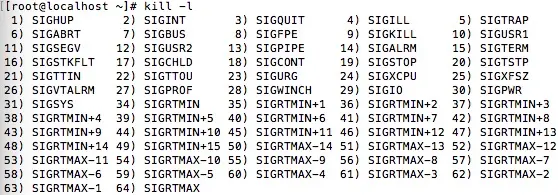

# 进程间通信
简称  **IPC（InterProcess Communication）**
进程间通信（IPC，InterProcess Communication）是指在不同进程之间传播或交换信息。
IPC的方式通常有管道（包括无名管道和命名管道）、消息队列、信号量、共享存储、Socket、Streams等。其中 Socket和Streams支持不同主机上的两个进程IPC。
## 管道
管道，通常指无名管道，是 UNIX 系统IPC最古老的形式。

1. **特点：**
(1)它是半双工的（即数据只能在一个方向上流动），**具有固定的读端和写端**,管道中的数据读走就没了。
(2) 它只能用于具有亲缘关系的进程之间的通信（也是父子进程或者兄弟进程之间）。
(3) 它可以看成是一种特殊的文件，对于它的读写也可以使用普通的read、write 等函数。但是它不是普通的文件，并不属于其他任何文件系统，并且只存在于内存中。
2. **原型：**
~~~c
        #include <unistd.h>
        int pipe(int fd[2]);    // 返回值：若成功返回0，失败返回-1
~~~
当一个管道建立时，它会创建两个文件描述符：fd[0]为读而打开，fd[1]为写而打开。

3. **为什么读之前要关闭写，写之前要关闭读？**

- 为什么读之前要关闭写端
避免阻塞问题：当管道的读端被打开时，如果写端仍然打开，操作系统可能会认为管道仍然处于“活跃”状态，即使没有数据可读，读操作可能会阻塞，等待数据到来。关闭写端后，操作系统会意识到管道不再有数据写入，从而在读端无数据时返回EOF（文件结束标志），避免阻塞。
资源管理：每个文件描述符都占用系统资源。关闭不必要的文件描述符可以释放资源，避免资源泄漏。
3. 为什么写之前要关闭读端
避免写入数据被错误读取：如果写端和读端同时打开，写入的数据可能会被错误地读取，导致数据混乱。关闭读端可以确保写入的数据只被目标进程读取。
防止管道自环：如果不关闭读端，写入的数据可能会被当前进程的读端读取，形成自环，导致数据无法正确传递到目标进程。
资源管理：同上，关闭不必要的文件描述符可以释放资源，避免资源泄漏。
4. 具体实现中的例子
假设父进程和子进程通过管道通信：
父进程：
创建管道后，会得到两个文件描述符：pipefd[0]（读端）和pipefd[1]（写端）。
父进程在fork()后，将pipefd[0]（读端）传递给子进程。
父进程在写入数据之前，关闭pipefd[0]（读端），然后通过pipefd[1]（写端）向管道中写入数据。
子进程：
子进程从父进程继承了管道的两个文件描述符。
子进程在读取数据之前，关闭pipefd[1]（写端），然后通过pipefd[0]（读端）从管道中读取数据。

4. 补充：
   read函数在读数据时候没有函数会阻塞。

## FIFO
FIFO，也称为命名管道，它是一种文件类型。
1. 特点
FIFO可以在无关的进程之间交换数据，与无名管道不同。
FIFO有路径名与之相关联，它以一种特殊设备文件形式存在于文件系统中。

2. 原型
~~~c
#include <sys/types.h>
#include <sys/stat.h>
int mkfifo(const char *pathname, mode_t mode);
// 返回值：成功返回0，出错返回-1
~~~
其中的 mode 参数与open函数中的 mode 相同。一旦创建了一个 FIFO，就可以用一般的文件I/O函数操作它。

当 open 一个FIFO时，是否设置非阻塞标志（O_NONBLOCK）的区别：

若没有指定O_NONBLOCK（默认是没有指定），只读 open 要阻塞到某个其他进程为写而打开此 FIFO。类似的，只写 open 要阻塞到某个其他进程为读而打开它。

若指定了O_NONBLOCK，则只读 open 立即返回。而只写 open 将出错返回 -1 如果没有进程已经为读而打开该 FIFO，其errno置ENXIO。

3. 在 Linux 文件系统中，文件类型用单个字符表示，例如：
-：普通文件
d：目录
l：符号链接
c：字符设备文件
b：块设备文件
p：命名管道（FIFO）

## 消息队列
消息队列，是消息的链接表，存放在**内核**中。一个消息队列由一个标识符（即队列ID）来标识。

1. **特点**
消息队列是面向记录的，其中的**消息具有特定的格式以及特定的优先级**。
消息队列**独立于发送与接收进程**。进程终止时，消息队列及其内容并不会被删除。
消息队列可以实现消息的**随机查询**,消息不一定要以先进先出的次序读取,也可以按消息的类型读取。

2. **原型**

~~~c
        #include <sys/msg.h>
        // 创建或打开消息队列：成功返回队列ID，失败返回-1
        int msgget(key_t key, int flag);
        // 添加消息：成功返回0，失败返回-1
        int msgsnd(int msqid, const void *ptr, size_t size, int flag);
        // 读取消息：成功返回消息数据的长度，失败返回-1
        int msgrcv(int msqid, void *ptr, size_t size, long type,int flag);
        // 控制消息队列：成功返回0，失败返回-1
        int msgctl(int msqid, int cmd, struct msqid_ds *buf);
~~~
key 是由 ftok 生成的逻辑标识符，用于标识消息队列。
msgID 是由 msgget 返回的实际消息队列标识符，用于在系统中唯一标识消息队列

在以下两种情况下，msgget将创建一个新的消息队列：

- 如果没有与键值key相对应的消息队列，并且flag中包含了IPC_CREAT标志位。
- key参数为IPC_PRIVATE。
  

函数msgrcv在读取消息队列时，type参数有下面几种情况：
- type == 0，返回队列中的第一个消息；
- type > 0，返回队列中消息类型为 type 的第一个消息；
- type < 0，返回队列中消息类型值小于或等于 type 绝对值的消息，如果有多个，则取类型值最小的消息。
可以看出，type值非 0 时用于以非先进先出次序读消息。也可以把 type 看做优先级的权值。

flag
- msgsnd 的 flag 参数：
IPC_NOWAIT：非阻塞模式，队列满时立即返回。
默认行为（flag = 0）：阻塞模式，直到有空间可用。
- msgrcv 的 flag 参数：
IPC_NOWAIT：非阻塞模式，队列为空时立即返回。
MSG_NOERROR：允许消息截断，不报错。
默认行为（flag = 0）：阻塞模式，直到有消息到

cmd 一般使用`IPC_RMID`参数，表示删除消息队列。

## 共享内存
共享内存（Shared Memory），指两个或多个进程共享一个给定的存储区。
1. 特点
共享内存是最快的一种 IPC，因为进程是直接对内存进行存取。
因为多个进程可以同时操作，所以需要进行同步。
信号量+共享内存通常结合在一起使用，信号量用来同步对共享内存的访问。

2. 原型
~~~c
        #include <sys/shm.h>
        // 创建或获取一个共享内存：成功返回共享内存ID，失败返回-1
        int shmget(key_t key, size_t size, int flag);
        // 连接共享内存到当前进程的地址空间：成功返回指向共享内存的指针，失败返回-1
        void *shmat(int shm_id, const void *addr, int flag);
        // 断开与共享内存的连接：成功返回0，失败返回-1
        int shmdt(void *addr); 
        // 控制共享内存的相关信息：成功返回0，失败返回-1
        int shmctl(int shm_id, int cmd, struct shmid_ds *buf);
~~~
3. 步骤：
创建共享内存
映射
数据
释放共享内存
干掉

当用shmget函数创建一段共享内存时，必须指定其 size；而如果引用一个已存在的共享内存，则将 size 指定为0 。

当一段共享内存被创建以后，它并不能被任何进程访问。必须使用shmat函数连接该共享内存到当前进程的地址空间，连接成功后把共享内存区对象映射到调用进程的地址空间，随后可像本地空间一样访问。

shmdt函数是用来断开shmat建立的连接的。注意，这并不是从系统中删除该共享内存，只是当前进程不能再访问该共享内存而已。

shmctl函数可以对共享内存执行多种操作，根据参数 cmd 执行相应的操作。常用的是IPC_RMID（从系统中删除该共享内存）。
4. 参数详解
   const void *addr 一般写0 存储段连接到由内核选择的第一个可以的地址上（linux内核自动操作）
   int flag 一般写0 表示可读可写

## 信号（signal）

信号是软中断，许多重要的程序都需要处理信号。信号，为 Linux 提供了一种处理异步事件的方法。比如，终端用户输入了 ctrl+c 来中断程序，会通过信号机制停止一个程序。
1. 信号的名字和编号：
每个信号都有一个名字和编号，这些名字都以“SIG”开头，例如“SIGIO ”、“SIGCHLD”等等。
信号定义在signal.h头文件中，信号名都定义为正整数。
具体的信号名称可以使用kill -l来查看信号的名字以及序号，信号是从1开始编号的，不存在0号信号。kill对于信号0又特殊的应用。


2. kill命令说明
kill 命令的主要功能确实是用于“杀死”（终止）进程，但它不仅仅局限于终止进程。kill 命令的核心功能是向进程发送信号，而这些信号可以有不同的作用，包括但不限于终止进程。
kill默认情况下，kill 向进程发送 SIGTERM（信号编号为15）信号。SIGTERM 是请求一个进程终止的信号，但进程可以选择捕获并优雅地处理它。例如：
~~~bash
        kill <PID>
~~~
- 这条命令会向指定的进程ID发送 SIGTERM 信号，请求进程退出。
如果进程没有响应 SIGTERM 信号，或者你需要立即终止进程，可以使用 -9 选项发送 SIGKILL 信号：SIGKILL是一个强制终止信号，进程无法捕获或忽略它。
~~~bash
        kill -9 <PID>
~~~
3. 信号的处理：
信号的处理有三种方法，分别是：忽略、捕捉和默认动作

- 忽略信号，大多数信号可以使用这个方式来处理，但是有两种信号不能被忽略（分别是 `SIGKILL`和`SIGSTOP`）。因为他们向内核和超级用户提供了进程终止和停止的可靠方法，如果忽略了，那么这个进程就变成了没人能管理的的进程，显然是内核设计者不希望看到的场景
- 捕捉信号，需要告诉内核，用户希望如何处理某一种信号，说白了就是写一个信号处理函数，然后将这个函数告诉内核。当该信号产生时，由内核来调用用户自定义的函数，以此来实现某种信号的处理。
- 系统默认动作，对于每个信号来说，系统都对应由默认的处理动作，当发生了该信号，系统会自动执行。不过，对系统来说，大部分的处理方式都比较粗暴，就是直接杀死该进程。
具体的信号默认动作可以使用man 7 signal来查看系统的具体定义。在此，我就不详细展开了，需要查看的，可以自行查看。也可以参考 《UNIX 环境高级编程（第三部）》的 P251——P256中间对于每个信号有详细的说明。

4. signal 函数原型
~~~c
#include <signal.h>
typedef void (*sighandler_t)(int);
sighandler_t signal(int signum, sighandler_t handler);
~~~
- 解释一下`typedef void (*sighandler_t)(int);` 这里的就是带参数的函数指针（函数指针就是指向函数的指针），例如有个函数
~~~c
void my_function(int a) {
    printf("Value: %d\n", a);
}
~~~
- 如果要定义一个指向这种函数的指针，通常需要写：
~~~c
void (*func_ptr)(int);  // 定义一个函数指针
~~~
- typedef的特殊用法就是这种
~~~c
typedef void (*sighandler_t)(int);
~~~
定义函数指针类型，typedef 将这个复杂的函数指针类型定义为一个新的名字 sighandler_t

5. sigaciton原型 (信号注册函数高级版)
~~~c
#include <signal.h>
int sigaction(int signum, const struct sigaction *act, struct sigaction *oldact);

struct sigaction {
   void       (*sa_handler)(int); //信号处理程序，不接受额外数据，SIG_IGN 为忽略，SIG_DFL 为默认动作
   void       (*sa_sigaction)(int, siginfo_t *, void *); //信号处理程序，能够接受额外数据和sigqueue配合使用
   sigset_t   sa_mask;//阻塞关键字的信号集，可以再调用捕捉函数之前，把信号添加到信号阻塞字，信号捕捉函数返回之前恢复为原先的值。
   int        sa_flags;//影响信号的行为SA_SIGINFO表示能够接受数据
 };
//回调函数句柄sa_handler、sa_sigaction只能任选其一
~~~

6. sigqueue信号发送函数高级用法
~~~c
#include <signal.h>
int sigqueue(pid_t pid, int sig, const union sigval value);
union sigval {
   int   sival_int;
   void *sival_ptr;
 };
~~~

sa_mask应用：

```c
struct sigaction act;
act.sa_handler = handler;
sigemptyset(&act.sa_mask);
act.sa_flags = 0;
if(sigaction(SIGQUIT, &act, NULL))
{
    printf("sigaction error.\n");
    exit(0);
}
```


## 信号量

1. 特点
信号量用于进程间同步，若要在进程间传递数据需要结合共享内存。
信号量基于操作系统的 PV 操作，程序对信号量的操作都是原子操作。
每次对信号量的 PV 操作不仅限于对信号量值加 1 或减 1，而且可以加减任意正整数。
支持信号量组。

2. 原型
最简单的信号量是只能取 0 和 1 的变量，这也是信号量最常见的一种形式，叫做二值信号量（Binary Semaphore）。而可以取多个正整数的信号量被称为通用信号量。
Linux 下的信号量函数都是在通用的信号量数组上进行操作，而不是在一个单一的二值信号量上进行操作。

~~~c
#include <sys/sem.h>
// 创建或获取一个信号量组：若成功返回信号量集ID，失败返回-1
int semget(key_t key, int num_sems, int sem_flags);
// 对信号量组进行操作，改变信号量的值：成功返回0，失败返回-1
int semop(int semid, struct sembuf semoparray[], size_t numops);  
// 控制信号量的相关信息
int semctl(int semid, int sem_num, int cmd, ...);
~~~

